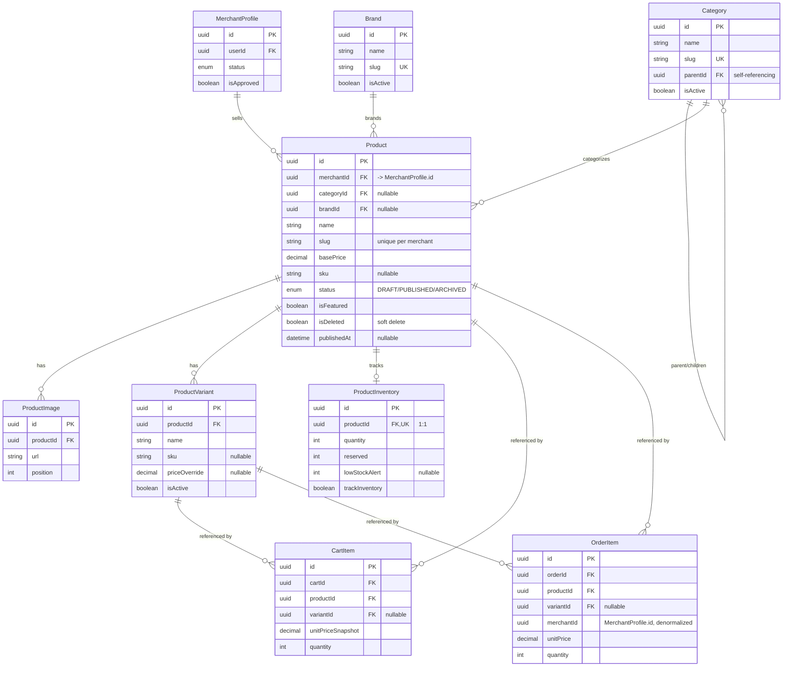

# Product Catalog — Entity Relationship Diagram

**Date:** 2026-07-28
**Scope:** The catalog domain (`Category`, `Brand`, `Product`, `ProductImage`, `ProductVariant`, `ProductInventory`) plus its direct connections into the pre-existing schema (`MerchantProfile`, `Cart`/`CartItem`, `Order`/`OrderItem`), so relationships to reused models are visible, not just the new tables in isolation.

Source of truth is always `apps/backend/prisma/schema.prisma` — this diagram is a snapshot as of the PR #44 merge (`d17ff67f`) and should be regenerated when the catalog domain changes materially (e.g. when CAT-002–CAT-005 land).

## Notes for future design discussions

- **`Product.merchantId` targets `MerchantProfile.id`, not `User.id`.** This is a real, previously-fixed footgun elsewhere in the schema: `Business.merchantId` (a different table, part of the merchant-onboarding domain) targets `User.id`. Same field name, two different ID spaces. If you add a new model that references "the merchant," check which one you actually need.
- **`Category` is self-referencing** (`parentId` → `Category.id`) for a hierarchy — there's no separate `CategorySubcategory` join table.
- **`ProductVariant` is intentionally flat today** — `name`/`sku`/`priceOverride`, no structured attribute/value pairs (e.g. `Color=Red`). That's the gap tracked as CAT-002.
- **`ProductInventory` is current-state only** — no history of changes over time. That's CAT-003 (`StockMovement`).
- **`CartItem`/`OrderItem` snapshot product data** (`productNameSnapshot`, `unitPriceSnapshot`, etc.) at the time of add/purchase, separate from the live `Product` row — this is deliberate (order history shouldn't change retroactively if a merchant edits a product later), not denormalization debt.
- **No `ProductTag` or `Collection` models exist yet** — CAT-004 and CAT-005.
