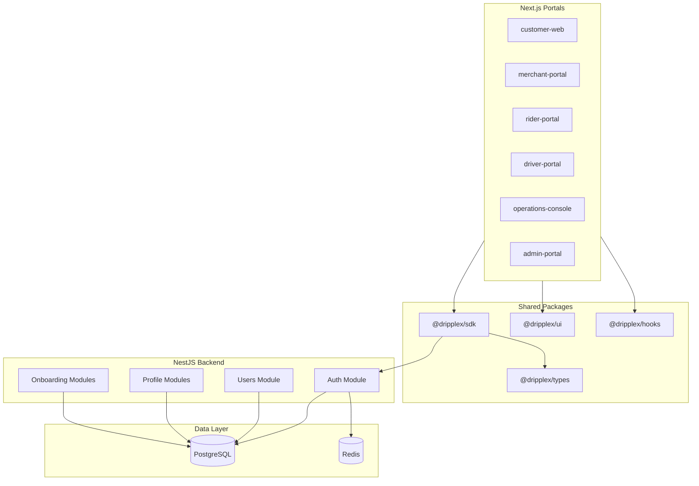
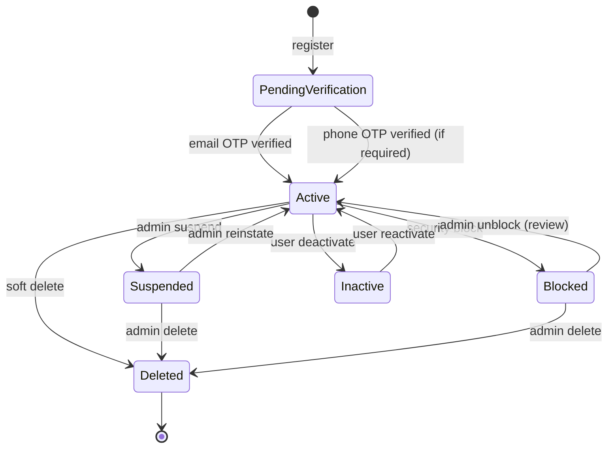
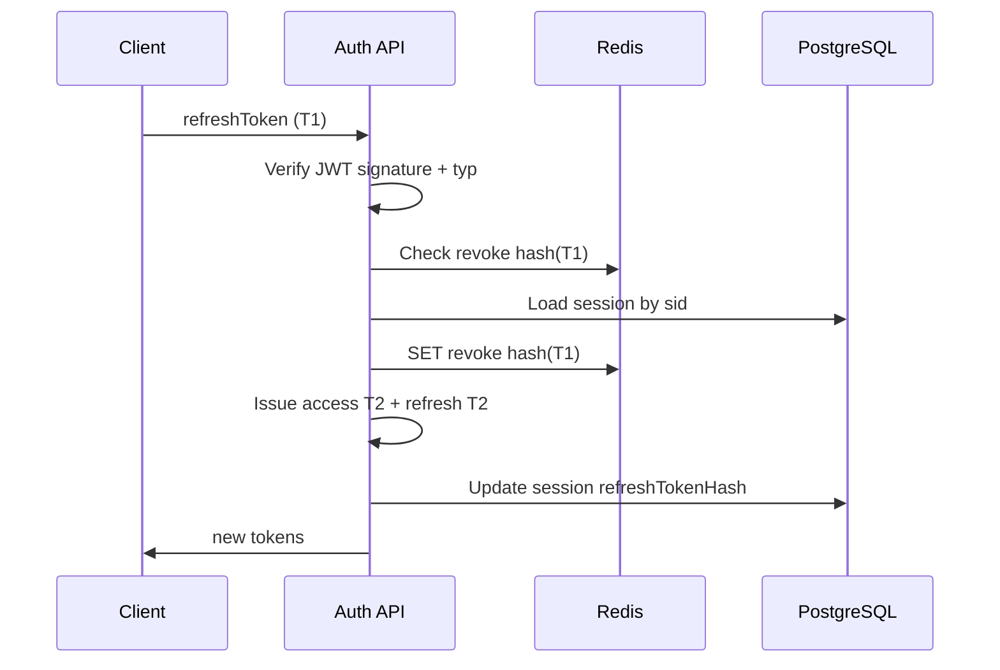
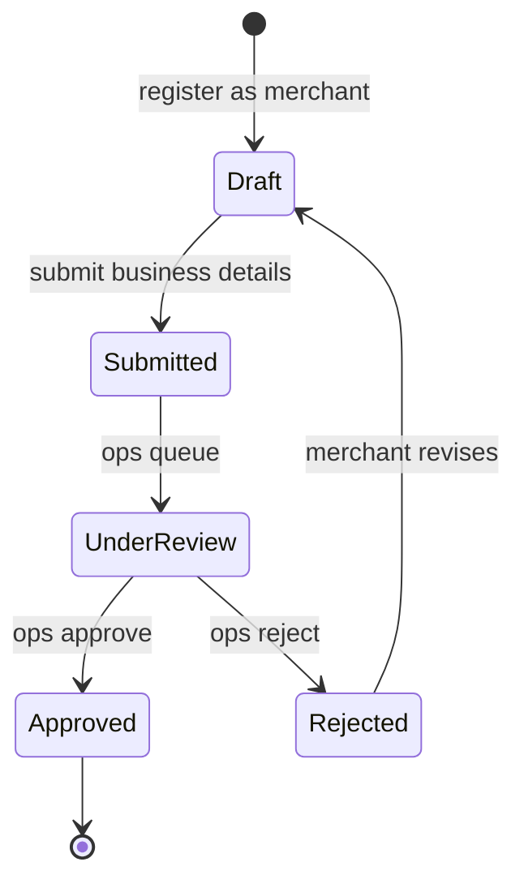
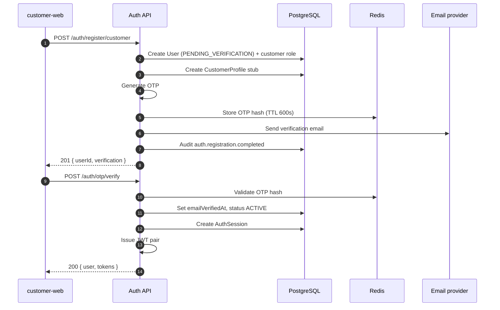
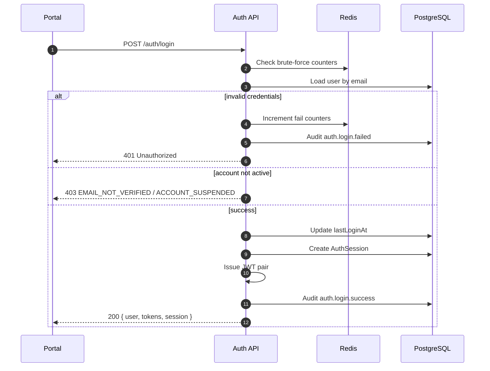
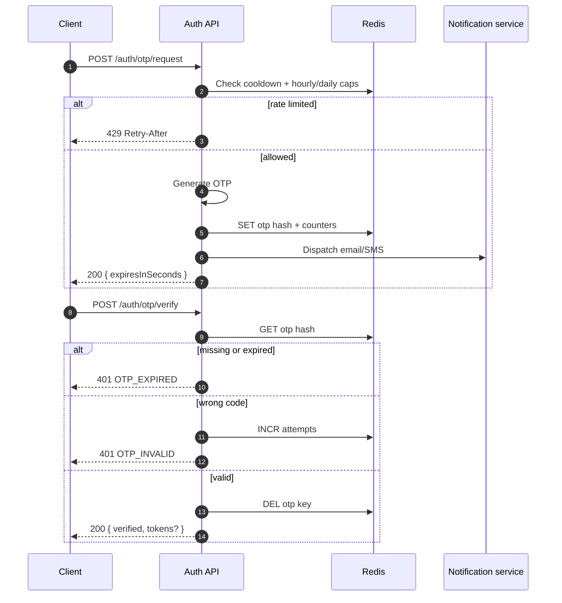
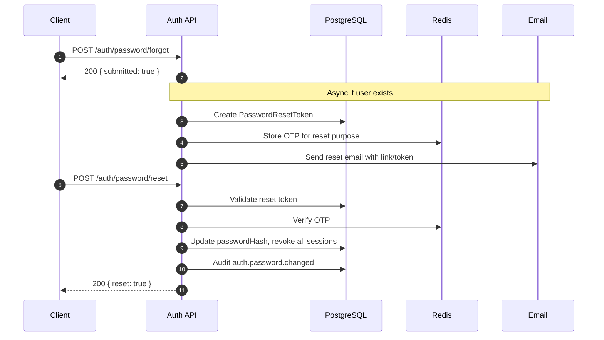
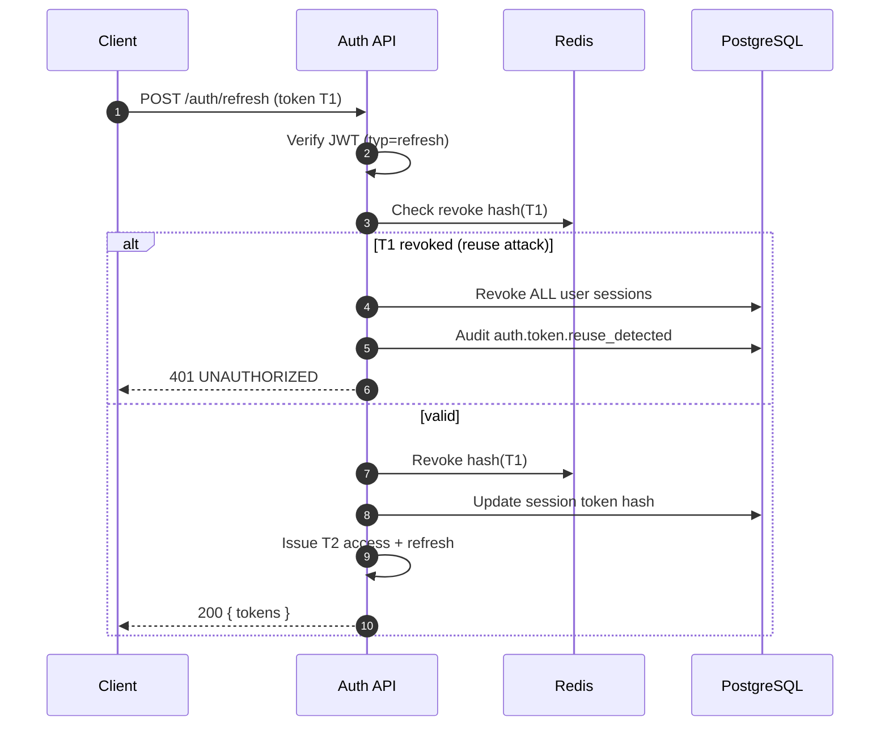
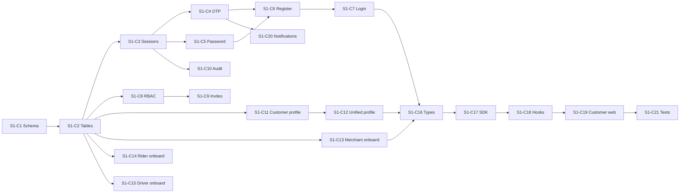

# DPX-013 — Identity & Authentication Architecture

| Field            | Value                                   |
| ---------------- | --------------------------------------- |
| **Document ID**  | DPX-013                                 |
| **Title**        | Identity & Authentication Architecture  |
| **Platform**     | Dripplex — _life,Simplified_            |
| **Sprint**       | Sprint 1 (implementation specification) |
| **Status**       | Approved for implementation planning    |
| **Scope**        | Architecture & API contracts only       |
| **Baseline**     | Sprint 0.1 (`v0.1.0-foundation`)        |
| **Last updated** | 2026-07-21                              |

---

## Executive summary

DPX-013 defines the complete identity and authentication layer for Dripplex across all portals: **Customer**, **Merchant**, **Rider**, **Driver**, **Operations Staff**, **Administrator**, and **Super Administrator**.

Sprint 0.1 delivered a working scaffold: NestJS `AuthModule`, Prisma `User`/`Role`/`Permission` models, JWT access/refresh tokens, email OTP in Redis, refresh revocation, and RBAC guards. Sprint 1 extends that foundation into a production-grade, multi-portal identity system without rewriting the monorepo structure established in Commits 1–5.

**Principles carried forward from Sprint 0.1:**

- Versioned REST under `/api/v1/`
- Consistent `{ success, data }` / error envelope
- Repository pattern over Prisma
- Shared contracts in `@dripplex/types` and `@dripplex/sdk`
- Strict TypeScript, no `any`
- UUID primary keys, soft delete, audit timestamps

---

## Table of contents

1. [Authentication flows](#1-authentication-flows)
2. [OTP](#2-otp)
3. [Password management](#3-password-management)
4. [JWT](#4-jwt)
5. [RBAC](#5-rbac)
6. [User lifecycle](#6-user-lifecycle)
7. [Merchant onboarding](#7-merchant-onboarding)
8. [Driver onboarding](#8-driver-onboarding)
9. [Rider onboarding](#9-rider-onboarding)
10. [Customer profile](#10-customer-profile)
11. [Database](#11-database)
12. [API contracts](#12-api-contracts)
13. [Security](#13-security)
14. [Sequence diagrams](#14-sequence-diagrams)
15. [Folder structure](#15-folder-structure)
16. [Implementation plan](#16-implementation-plan)

---

## Platform context



| Layer     | Technology                         | Role in identity                             |
| --------- | ---------------------------------- | -------------------------------------------- |
| API       | NestJS 11                          | Auth, users, profiles, onboarding            |
| ORM       | Prisma 6                           | Persistence, migrations                      |
| Database  | PostgreSQL 16                      | Users, roles, sessions, profiles, audit      |
| Cache     | Redis 7                            | OTP, rate limits, token revocation           |
| Tokens    | JWT (access + refresh)             | Stateless API auth with server-side sessions |
| Frontends | Next.js 15 × 6 portals             | Registration, login, profile UX              |
| Contracts | `@dripplex/types`, `@dripplex/sdk` | Shared validation and HTTP client            |

---

## 1. Authentication flows

### 1.1 Actor model

Every human actor maps to exactly one `User` record. Portal access is determined by **roles** assigned at registration or by an administrator. A user may hold multiple roles (e.g. `customer` + `merchant`) but each portal enforces its required role at login.

| Actor               | Role slug             | Registration surface         | Post-registration requirement           |
| ------------------- | --------------------- | ---------------------------- | --------------------------------------- |
| Customer            | `customer`            | `customer-web` self-serve    | Email OTP; phone OTP optional           |
| Merchant            | `merchant`            | `merchant-portal` self-serve | Email OTP + merchant onboarding         |
| Rider               | `rider`               | `rider-portal` self-serve    | Email OTP + rider KYC onboarding        |
| Driver              | `driver`              | `driver-portal` self-serve   | Email OTP + driver KYC onboarding       |
| Operations staff    | `operations_staff`    | Invitation only              | Admin-created; email OTP on first login |
| Administrator       | `administrator`       | Invitation only              | Super-admin created                     |
| Super administrator | `super_administrator` | Bootstrap seed only          | MFA required (Sprint 1.1 if deferred)   |

### 1.2 Registration

**Unified rules (all self-serve portals):**

1. Client submits registration DTO with portal context (`registrationChannel`).
2. API validates uniqueness of email and optional phone.
3. Password hashed with bcrypt (12 rounds, configurable).
4. User created with `status = PENDING_VERIFICATION`.
5. Default role for portal assigned (`customer`, `merchant`, `rider`, or `driver`).
6. Email OTP dispatched; **no tokens issued until email verified** (Sprint 1 policy change from Sprint 0.1 scaffold which issued tokens immediately).
7. Portal-specific profile stub created (empty `CustomerProfile`, `MerchantProfile`, etc.).
8. Audit event `auth.registration.completed` recorded.

**Portal-specific registration endpoints** replace the generic `POST /auth/register` from Sprint 0.1. The legacy endpoint is deprecated and removed after migration.



### 1.3 Login

1. Client sends email + password (+ optional `rememberMe`, `deviceId`, `deviceName`).
2. API validates credentials; generic error on failure (anti-enumeration).
3. Brute-force counter checked in Redis per `email` and per `ip`.
4. Account status checked (`SUSPENDED`, `BLOCKED`, `INACTIVE`, `deletedAt` reject login).
5. Email verification required before login for self-serve registrations.
6. On success: `lastLoginAt` updated, session row created, tokens issued.
7. Audit event `auth.login.success` or `auth.login.failed` recorded.

### 1.4 Logout

| Mode              | Behaviour                                                                              |
| ----------------- | -------------------------------------------------------------------------------------- |
| **Single device** | Revoke current refresh token; mark session `revokedAt`; access token expires naturally |
| **All devices**   | Revoke all refresh tokens for user; invalidate all active sessions                     |

Logout is idempotent: invalid or already-revoked refresh tokens return `{ loggedOut: true }`.

### 1.5 Refresh token

1. Client sends refresh token (body) or httpOnly cookie (portal preference).
2. API verifies JWT signature, `typ === 'refresh'`, expiry.
3. Checks Redis revocation set and `AuthSession` row status.
4. **Rotation:** issue new access + refresh pair; revoke previous refresh token.
5. Update session `lastSeenAt` and `rotatedAt`.

Detect **refresh token reuse** (revoked token presented again): revoke all sessions for user, force re-login, emit `auth.token.reuse_detected` audit event.

### 1.6 Session management

Sessions are **server-authoritative** records linked to refresh tokens.

| Field              | Purpose                                    |
| ------------------ | ------------------------------------------ |
| `id`               | Session UUID                               |
| `userId`           | Owner                                      |
| `refreshTokenHash` | SHA-256 of refresh token (never store raw) |
| `deviceId`         | Client-generated stable device identifier  |
| `deviceName`       | Human-readable label ("Chrome on MacBook") |
| `ipAddress`        | Last known IP                              |
| `userAgent`        | Parsed user agent                          |
| `rememberMe`       | Extended refresh TTL when true             |
| `expiresAt`        | Session expiry                             |
| `revokedAt`        | Null when active                           |
| `lastSeenAt`       | Updated on refresh                         |

**User-facing session APIs:**

- `GET /auth/sessions` — list active sessions for current user
- `DELETE /auth/sessions/:sessionId` — revoke one session
- `DELETE /auth/sessions` — revoke all except current (optional `?exceptCurrent=true`)

### 1.7 Remember me

| Setting     | Access token TTL | Refresh token / session TTL |
| ----------- | ---------------- | --------------------------- |
| Default     | 15 minutes       | 7 days                      |
| Remember me | 15 minutes       | 30 days                     |

Remember-me only extends **refresh/session** lifetime. Access tokens remain short-lived.

---

## 2. OTP

### 2.1 Channels

| Channel   | Use cases                                          | Provider (Nigeria)        |
| --------- | -------------------------------------------------- | ------------------------- |
| **Email** | Registration verify, login step-up, password reset | SendGrid / AWS SES        |
| **SMS**   | Phone verify, login step-up, high-risk actions     | Termii / Africa's Talking |

OTP codes are numeric, cryptographically random, stored as SHA-256 hashes in Redis.

### 2.2 OTP purposes

| Purpose              | Key prefix                 | Channels  | Required for                           |
| -------------------- | -------------------------- | --------- | -------------------------------------- |
| `email_verification` | `auth:otp:email:{email}`   | Email     | All self-serve                         |
| `phone_verification` | `auth:otp:phone:{phone}`   | SMS       | Rider, driver, merchant (configurable) |
| `password_reset`     | `auth:otp:reset:{email}`   | Email     | Forgot password                        |
| `login_step_up`      | `auth:otp:stepup:{userId}` | Email/SMS | Risk-based (future)                    |

### 2.3 Expiry

| Purpose            | TTL (seconds) | Config key              |
| ------------------ | ------------- | ----------------------- |
| Email verification | 600 (10 min)  | `OTP_EMAIL_TTL_SECONDS` |
| Phone verification | 300 (5 min)   | `OTP_SMS_TTL_SECONDS`   |
| Password reset     | 900 (15 min)  | `OTP_RESET_TTL_SECONDS` |

### 2.4 Resend policy

| Rule                           | Value                                       |
| ------------------------------ | ------------------------------------------- |
| Minimum interval between sends | 60 seconds per purpose + identifier         |
| Maximum sends per hour         | 5 per purpose + identifier                  |
| Maximum sends per day          | 10 per purpose + identifier                 |
| Response on rate limit         | `429` with `Retry-After` header             |
| Anti-enumeration               | Identical success shape whether user exists |

Redis keys:

- `auth:otp:cooldown:{purpose}:{identifier}` — resend cooldown
- `auth:otp:hourly:{purpose}:{identifier}` — hourly counter
- `auth:otp:daily:{purpose}:{identifier}` — daily counter

### 2.5 Rate limiting (verification attempts)

| Rule                | Value                        |
| ------------------- | ---------------------------- |
| Max verify attempts | 5 per OTP issuance           |
| Lockout after max   | 15 minutes                   |
| Counter key         | `auth:otp:attempts:{otpKey}` |

After lockout, user must request a new OTP.

### 2.6 Maximum attempts summary

| Layer              | Limit                        | HTTP code |
| ------------------ | ---------------------------- | --------- |
| OTP verify         | 5 per code                   | 401       |
| OTP resend         | 5/hour, 10/day               | 429       |
| Login              | 10 failures / 15 min / email | 401       |
| Login (IP)         | 30 failures / 15 min / IP    | 429       |
| Registration       | 10 / hour / IP               | 429       |
| Password reset req | 5 / hour / email             | 429       |

---

## 3. Password management

### 3.1 Password policy

| Rule             | Requirement                                                                                    |
| ---------------- | ---------------------------------------------------------------------------------------------- |
| Minimum length   | 8 characters                                                                                   |
| Maximum length   | 128 characters (bcrypt limit)                                                                  |
| Complexity       | At least one uppercase, one lowercase, one digit                                               |
| Common passwords | Reject top 10,000 breached passwords (Have I Been Pwned k-anonymity API or local bloom filter) |
| History          | Cannot reuse last 5 passwords (Sprint 1.1 if deferred)                                         |
| Max age          | None in Sprint 1 (enterprise policy later)                                                     |

Validation is enforced in DTOs (class-validator) and mirrored in `@dripplex/types` Zod schemas.

### 3.2 Forgot password

1. `POST /auth/password/forgot` with email.
2. Anti-enumeration: always return `{ submitted: true }`.
3. If user exists and is active: generate OTP + signed reset token; send email.
4. Reset token is a separate JWT (`typ: 'password_reset'`, 15 min TTL) **or** opaque UUID stored in Redis — **recommend opaque UUID** in `password_reset_tokens` table for auditability.

### 3.3 Reset password

1. `POST /auth/password/reset` with `resetToken` + `otp` + `newPassword`.
2. Validate OTP and reset token.
3. Update `passwordHash`, set `passwordChangedAt`.
4. Revoke **all** sessions and refresh tokens for user.
5. Send confirmation email.

### 3.4 Change password (authenticated)

1. `POST /auth/password/change` with `currentPassword` + `newPassword`.
2. Requires valid access token.
3. Same revocation policy as reset.
4. Cannot reuse current password.

---

## 4. JWT

### 4.1 Access token

| Claim         | Type     | Description                  |
| ------------- | -------- | ---------------------------- |
| `sub`         | UUID     | User ID                      |
| `email`       | string   | Primary email                |
| `roles`       | string[] | Role slugs                   |
| `permissions` | string[] | Flattened permission codes   |
| `typ`         | `access` | Token type discriminator     |
| `sid`         | UUID     | Session ID (new in Sprint 1) |
| `iat` / `exp` | number   | Standard JWT timestamps      |

**TTL:** 15 minutes (config: `JWT_ACCESS_TTL=15m`).

Access tokens are **not** stored server-side. Revocation is achieved via short TTL + session/refresh revocation.

### 4.2 Refresh token

| Claim       | Type      | Description         |
| ----------- | --------- | ------------------- |
| `sub`       | UUID      | User ID             |
| `typ`       | `refresh` | Token type          |
| `sid`       | UUID      | Session ID          |
| `iat`/`exp` | number    | Standard timestamps |

**TTL:** 7 days default; 30 days with remember-me.

Separate signing secret: `JWT_REFRESH_SECRET` (min 32 chars).

### 4.3 Rotation

On every `POST /auth/refresh`:



### 4.4 Revocation

| Mechanism             | Storage                                              | Use case                          |
| --------------------- | ---------------------------------------------------- | --------------------------------- |
| Refresh token hash    | Redis `auth:refresh:revoke:{hash}`                   | Single logout, rotation           |
| Session `revokedAt`   | PostgreSQL `auth_sessions`                           | Authoritative session state       |
| User-level revoke all | Redis `auth:user:revoke_all:{userId}` with timestamp | Invalidate tokens issued before T |

JWT `validate()` must check user-level revoke timestamp against token `iat`.

### 4.5 Redis storage layout

| Key pattern                        | Value          | TTL                   |
| ---------------------------------- | -------------- | --------------------- |
| `auth:otp:email:{email}`           | OTP hash       | Purpose TTL           |
| `auth:otp:phone:{phone}`           | OTP hash       | Purpose TTL           |
| `auth:refresh:revoke:{hash}`       | `userId`       | Remaining refresh TTL |
| `auth:login:fail:{email}`          | attempt count  | 15 minutes            |
| `auth:login:fail:ip:{ip}`          | attempt count  | 15 minutes            |
| `auth:user:revoke_all:{userId}`    | Unix timestamp | Max refresh TTL       |
| `auth:otp:cooldown:{purpose}:{id}` | `1`            | 60 seconds            |

---

## 5. RBAC

### 5.1 Role definitions

| Role slug             | Display name        | System | Description                    |
| --------------------- | ------------------- | ------ | ------------------------------ |
| `customer`            | Customer            | Yes    | Marketplace consumer           |
| `merchant`            | Merchant            | Yes    | Store owner / operator         |
| `rider`               | Rider               | Yes    | Parcel / food delivery courier |
| `driver`              | Driver              | Yes    | Ride-hailing driver            |
| `operations_staff`    | Operations Staff    | Yes    | Internal ops console user      |
| `administrator`       | Administrator       | Yes    | Platform admin                 |
| `super_administrator` | Super Administrator | Yes    | Full platform control          |

### 5.2 Permission naming convention

`{resource}:{action}` or `{resource}:{sub-resource}:{action}`

Examples: `users:read`, `merchants:onboarding:approve`, `auth:sessions:revoke`.

### 5.3 Permission matrix

| Permission                    | customer | merchant | rider | driver | ops_staff | admin | super_admin |
| ----------------------------- | :------: | :------: | :---: | :----: | :-------: | :---: | :---------: |
| `profile:read`                |    ✓     |    ✓     |   ✓   |   ✓    |     ✓     |   ✓   |      ✓      |
| `profile:write`               |    ✓     |    ✓     |   ✓   |   ✓    |     ✓     |   ✓   |      ✓      |
| `auth:sessions:read`          |    ✓     |    ✓     |   ✓   |   ✓    |     ✓     |   ✓   |      ✓      |
| `auth:sessions:revoke`        |    ✓     |    ✓     |   ✓   |   ✓    |     ✓     |   ✓   |      ✓      |
| `customer:addresses:manage`   |    ✓     |          |       |        |           |       |             |
| `merchant:onboarding:submit`  |          |    ✓     |       |        |           |       |             |
| `merchant:onboarding:approve` |          |          |       |        |     ✓     |   ✓   |      ✓      |
| `rider:onboarding:submit`     |          |          |   ✓   |        |           |       |             |
| `rider:onboarding:approve`    |          |          |       |        |     ✓     |   ✓   |      ✓      |
| `driver:onboarding:submit`    |          |          |       |   ✓    |           |       |             |
| `driver:onboarding:approve`   |          |          |       |        |     ✓     |   ✓   |      ✓      |
| `users:read`                  |          |          |       |        |     ✓     |   ✓   |      ✓      |
| `users:write`                 |          |          |       |        |           |   ✓   |      ✓      |
| `users:delete`                |          |          |       |        |           |   ✓   |      ✓      |
| `users:roles:assign`          |          |          |       |        |           |   ✓   |      ✓      |
| `roles:read`                  |          |          |       |        |           |   ✓   |      ✓      |
| `roles:write`                 |          |          |       |        |           |       |      ✓      |
| `permissions:read`            |          |          |       |        |           |   ✓   |      ✓      |
| `audit:read`                  |          |          |       |        |     ✓     |   ✓   |      ✓      |
| `platform:settings:write`     |          |          |       |        |           |       |      ✓      |

### 5.4 Inheritance model

Dripplex uses **flat role → permission grants**, not nested role inheritance. Elevated access is modeled by assigning multiple roles or a higher-privilege role explicitly.

| Pattern             | Implementation                                                  |
| ------------------- | --------------------------------------------------------------- |
| Super admin ⊃ admin | `super_administrator` receives superset of permissions via seed |
| Admin ⊃ ops         | Separate permission sets; ops cannot manage roles               |
| Merchant + customer | Multiple `UserRole` rows                                        |

**JWT carries flattened permissions** at issuance time. Permission changes take effect on next token refresh (max 15 minutes delay for access token).

### 5.5 Enforcement

| Layer  | Mechanism                                                            |
| ------ | -------------------------------------------------------------------- |
| API    | `@RequirePermissions('code')` + `PermissionsGuard`                   |
| Portal | Route guards checking `user.permissions` from `/auth/me`             |
| UI     | `<Can permission="...">` wrapper in `@dripplex/ui` (Sprint 1 commit) |

---

## 6. User lifecycle

### 6.1 Status enum (recommended)

Extend Prisma `UserStatus`:

| Status                 | Meaning                              | Can login? |
| ---------------------- | ------------------------------------ | :--------: |
| `PENDING_VERIFICATION` | Registered; email/phone not verified |     No     |
| `ACTIVE`               | Verified and operational             |    Yes     |
| `INACTIVE`             | User-initiated deactivation          |     No     |
| `SUSPENDED`            | Temporary admin suspension           |     No     |
| `BLOCKED`              | Security/fraud block                 |     No     |

**Deleted** is represented by `deletedAt IS NOT NULL`, not a status value.

**Verified** is represented by timestamps (`emailVerifiedAt`, `phoneVerifiedAt`), not a separate status. Transition: `PENDING_VERIFICATION` → `ACTIVE` when required verifications complete.

### 6.2 Lifecycle transitions

| From                   | To                     | Trigger                   | Actor          |
| ---------------------- | ---------------------- | ------------------------- | -------------- |
| —                      | `PENDING_VERIFICATION` | Registration              | Self           |
| `PENDING_VERIFICATION` | `ACTIVE`               | Required OTP verified     | System         |
| `ACTIVE`               | `INACTIVE`             | User deactivates account  | Self           |
| `INACTIVE`             | `ACTIVE`               | User reactivates          | Self           |
| `ACTIVE`               | `SUSPENDED`            | Admin action              | Admin          |
| `SUSPENDED`            | `ACTIVE`               | Admin reinstate           | Admin          |
| `ACTIVE`               | `BLOCKED`              | Fraud / abuse             | Admin / system |
| `BLOCKED`              | `ACTIVE`               | Manual review unblock     | Super admin    |
| Any                    | Deleted                | Soft delete (`deletedAt`) | Self / admin   |

### 6.3 Verification requirements by portal

| Portal   | Email verify | Phone verify | Onboarding approval |
| -------- | :----------: | :----------: | :-----------------: |
| Customer |   Required   |   Optional   |         No          |
| Merchant |   Required   |   Required   |         Yes         |
| Rider    |   Required   |   Required   |         Yes         |
| Driver   |   Required   |   Required   |         Yes         |
| Ops      |   Required   |      —       |     Invitation      |
| Admin    |   Required   |      —       |     Invitation      |

---

## 7. Merchant onboarding

Merchant onboarding is a **post-registration** workflow before marketplace features unlock.

### 7.1 Stages



| Stage        | `MerchantOnboardingStatus` | Merchant can access portal?        |
| ------------ | -------------------------- | ---------------------------------- |
| Draft        | `DRAFT`                    | Limited (onboarding UI only)       |
| Submitted    | `SUBMITTED`                | Limited                            |
| Under review | `UNDER_REVIEW`             | Limited                            |
| Approved     | `APPROVED`                 | Full merchant features (Sprint 2+) |
| Rejected     | `REJECTED`                 | Limited (resubmit)                 |

### 7.2 Business registration data

| Field               | Type   | Required | Notes                                 |
| ------------------- | ------ | :------: | ------------------------------------- |
| `businessName`      | string |   Yes    | Registered or trading name            |
| `businessType`      | enum   |   Yes    | `SOLE_PROP`, `PARTNERSHIP`, `LIMITED` |
| `rcNumber`          | string |   Yes    | CAC registration number               |
| `taxId`             | string |    No    | TIN                                   |
| `businessEmail`     | string |   Yes    | May differ from user email            |
| `businessPhone`     | string |   Yes    | Nigerian E.164                        |
| `registeredAddress` | JSON   |   Yes    | Structured address                    |
| `operatingCity`     | string |   Yes    | Launch city                           |
| `businessCategory`  | string |   Yes    | Vertical (food, retail, etc.)         |

### 7.3 Business verification

| Document type         | Required | Storage                |
| --------------------- | :------: | ---------------------- |
| CAC certificate       |   Yes    | Object storage (S3/R2) |
| Government ID (owner) |   Yes    | Object storage         |
| Proof of address      |    No    | Object storage         |

Documents uploaded via pre-signed URLs; metadata in `onboarding_documents` table.

### 7.4 Approval workflow

1. Merchant submits → status `SUBMITTED`.
2. Ops notification enqueued (Sprint 2 notifications module).
3. Ops reviewer opens case in `operations-console`.
4. Approve → `APPROVED`, user retains `merchant` role, `merchantProfile.approvedAt` set.
5. Reject → `REJECTED` with `rejectionReason`; merchant may edit and resubmit.

---

## 8. Driver onboarding

### 8.1 Stages

Same state machine as merchant (`DRAFT` → `SUBMITTED` → `UNDER_REVIEW` → `APPROVED` / `REJECTED`).

### 8.2 Driver profile

| Field              | Type   | Required |
| ------------------ | ------ | :------: |
| `dateOfBirth`      | date   |   Yes    |
| `gender`           | enum   | Optional |
| `nationalIdNumber` | string |   Yes    |
| `nationalIdType`   | enum   |   Yes    | `NIN`, `PASSPORT`, `VOTERS_CARD` |
| `profilePhotoUrl`  | string |   Yes    |
| `cityOfOperation`  | string |   Yes    |
| `yearsExperience`  | number |    No    |

### 8.3 Vehicle

| Field           | Type   | Required |
| --------------- | ------ | :------: |
| `make`          | string |   Yes    |
| `model`         | string |   Yes    |
| `year`          | number |   Yes    |
| `color`         | string |   Yes    |
| `plateNumber`   | string |   Yes    |
| `vehicleType`   | enum   |   Yes    | `SEDAN`, `SUV`, `TRICYCLE`, `BIKE` |
| `seatCount`     | number |   Yes    |
| `ownershipType` | enum   |   Yes    | `OWNED`, `HIRED`                   |

### 8.4 Documents

| Document                      | Required |
| ----------------------------- | :------: |
| Driver's license (front/back) |   Yes    |
| Vehicle registration          |   Yes    |
| Roadworthiness certificate    |   Yes    |
| Insurance certificate         |   Yes    |
| Passport photograph           |   Yes    |

### 8.5 Approval

Ops verifies documents and vehicle data. On approval, `driver` role activation flag `driverProfile.isApproved = true`. Unapproved drivers may log in but cannot accept rides (Sprint 5).

---

## 9. Rider onboarding

Riders (delivery couriers) have a lighter onboarding than drivers.

### 9.1 Identity

| Field              | Type   | Required |
| ------------------ | ------ | :------: |
| `dateOfBirth`      | date   |   Yes    |
| `nationalIdNumber` | string |   Yes    |
| `nationalIdType`   | enum   |   Yes    |
| `profilePhotoUrl`  | string |   Yes    |
| `cityOfOperation`  | string |   Yes    |
| `emergencyContact` | JSON   |   Yes    |

### 9.2 Bank details (payout setup)

| Field           | Type   | Required | Notes                                    |
| --------------- | ------ | :------: | ---------------------------------------- |
| `bankCode`      | string |   Yes    | Nigerian bank code                       |
| `accountNumber` | string |   Yes    | 10 digits NUBAN                          |
| `accountName`   | string |   Yes    | Resolved via Paystack/Flutterwave verify |

Bank verification is async; status `PENDING` → `VERIFIED` / `FAILED`.

### 9.3 Verification documents

| Document                     | Required |
| ---------------------------- | :------: |
| Government ID                |   Yes    |
| Utility bill / address proof |    No    |

### 9.4 Approval

Ops approves rider identity and bank verification. `riderProfile.isApproved = true` unlocks dispatch eligibility (Sprint 5).

---

## 10. Customer profile

### 10.1 Personal details

| Field         | Source            |           Editable           |
| ------------- | ----------------- | :--------------------------: |
| `firstName`   | `User`            |             Yes              |
| `lastName`    | `User`            |             Yes              |
| `email`       | `User`            | No (change via verify flow)  |
| `phone`       | `User`            |        Via OTP verify        |
| `avatarUrl`   | `CustomerProfile` |             Yes              |
| `dateOfBirth` | `CustomerProfile` |           Optional           |
| `gender`      | `CustomerProfile` |           Optional           |
| `locale`      | `CustomerProfile` |    Yes (default `en_NG`)     |
| `timezone`    | `CustomerProfile` | Yes (default `Africa/Lagos`) |

### 10.2 Addresses

Structured `CustomerAddress` records:

| Field        | Type    | Notes                |
| ------------ | ------- | -------------------- |
| `label`      | string  | Home, Work, etc.     |
| `line1`      | string  | Street address       |
| `line2`      | string  | Optional             |
| `city`       | string  |                      |
| `state`      | string  | Nigerian state       |
| `postalCode` | string  | Optional             |
| `country`    | string  | Default `NG`         |
| `latitude`   | decimal | Optional geocode     |
| `longitude`  | decimal | Optional geocode     |
| `isDefault`  | boolean | One default per user |

### 10.3 Saved locations

Lightweight favourites for repeat use (map pin, landmark):

| Field       | Type                                   |
| ----------- | -------------------------------------- |
| `name`      | string                                 |
| `latitude`  | decimal                                |
| `longitude` | decimal                                |
| `placeId`   | string (optional Google/OSM reference) |

### 10.4 Preferences

| Preference             | Type    | Default |
| ---------------------- | ------- | ------- |
| `marketingEmail`       | boolean | false   |
| `marketingSms`         | boolean | false   |
| `pushNotifications`    | boolean | true    |
| `defaultPaymentMethod` | UUID    | null    |

Stored in `customer_preferences` JSON column or dedicated table.

---

## 11. Database

### 11.1 Current schema (Sprint 0.1)

Sprint 0.1 Prisma schema provides:

- `User` — core identity with `UserStatus`, email/phone uniqueness, soft delete
- `Role`, `Permission`, `UserRole`, `RolePermission` — RBAC junction tables
- `citext` extension for case-insensitive email

**Gaps for Sprint 1:**

- No session persistence
- No password reset tokens
- No audit log
- No portal-specific profiles
- No onboarding workflows
- No OTP attempt tracking in DB (Redis-only is acceptable for attempts; audit needs DB)
- `UserStatus` missing `BLOCKED`
- No `passwordChangedAt`, `registrationChannel`, `failedLoginCount`

### 11.2 Recommended schema additions

#### Enum extensions

```prisma
enum UserStatus {
  PENDING_VERIFICATION
  ACTIVE
  INACTIVE
  SUSPENDED
  BLOCKED
}

enum RegistrationChannel {
  CUSTOMER_WEB
  MERCHANT_PORTAL
  RIDER_PORTAL
  DRIVER_PORTAL
  OPS_INVITE
  ADMIN_INVITE
  SEED
}

enum OnboardingStatus {
  DRAFT
  SUBMITTED
  UNDER_REVIEW
  APPROVED
  REJECTED
}
```

#### New models (conceptual — not implemented in this document)

| Model                   | Purpose                                  |
| ----------------------- | ---------------------------------------- |
| `AuthSession`           | Server-side session + refresh token hash |
| `PasswordResetToken`    | Opaque reset tokens with expiry          |
| `PasswordHistory`       | Optional: last N password hashes         |
| `AuditLog`              | Immutable security audit trail           |
| `CustomerProfile`       | 1:1 with User for customers              |
| `CustomerAddress`       | 1:N addresses                            |
| `CustomerSavedLocation` | 1:N saved pins                           |
| `MerchantProfile`       | 1:1 business entity                      |
| `MerchantOnboarding`    | Onboarding state + business fields       |
| `RiderProfile`          | 1:1 rider identity + bank                |
| `DriverProfile`         | 1:1 driver identity                      |
| `DriverVehicle`         | 1:1 or 1:N vehicles per driver           |
| `OnboardingDocument`    | Polymorphic document metadata            |
| `UserInvitation`        | Admin/ops invite tokens                  |

#### `AuthSession` (recommended)

```prisma
model AuthSession {
  id               String    @id @default(uuid()) @db.Uuid
  userId           String    @map("user_id") @db.Uuid
  refreshTokenHash String    @map("refresh_token_hash") @db.VarChar(64)
  deviceId         String?   @map("device_id") @db.VarChar(128)
  deviceName       String?   @map("device_name") @db.VarChar(255)
  ipAddress        String?   @map("ip_address") @db.VarChar(45)
  userAgent        String?   @map("user_agent") @db.VarChar(512)
  rememberMe       Boolean   @default(false) @map("remember_me")
  expiresAt        DateTime  @map("expires_at")
  revokedAt        DateTime? @map("revoked_at")
  lastSeenAt       DateTime  @default(now()) @map("last_seen_at")
  createdAt        DateTime  @default(now()) @map("created_at")
  user             User      @relation(fields: [userId], references: [id], onDelete: Cascade)

  @@index([userId])
  @@index([refreshTokenHash])
  @@index([expiresAt])
  @@map("auth_sessions")
}
```

#### `User` field additions

| Field                 | Type                  | Purpose                |
| --------------------- | --------------------- | ---------------------- |
| `registrationChannel` | `RegistrationChannel` | Audit / analytics      |
| `passwordChangedAt`   | `DateTime?`           | Force re-auth policies |
| `blockedAt`           | `DateTime?`           | When status = BLOCKED  |
| `blockedReason`       | `String?`             | Admin notes            |

#### Index recommendations

| Table           | Index                      | Reason                |
| --------------- | -------------------------- | --------------------- |
| `auth_sessions` | `(userId, revokedAt)`      | List active sessions  |
| `audit_logs`    | `(userId, createdAt DESC)` | User activity history |
| `audit_logs`    | `(action, createdAt DESC)` | Security queries      |
| `users`         | `(registrationChannel)`    | Portal analytics      |

### 11.3 Seed data

Sprint 1 migration seed must insert:

- 7 system roles (slugs in §5.1)
- Permission catalog (matrix in §5.3)
- Role-permission grants
- One `super_administrator` bootstrap user (env-gated credentials, disabled in production without explicit flag)

### 11.4 Migration strategy

1. Additive migrations only — no destructive changes to Sprint 0.1 tables.
2. Backfill existing users with `registrationChannel = CUSTOMER_WEB` and `customer` role if missing.
3. Deprecate generic `POST /auth/register` after portal endpoints ship.

---

## 12. API contracts

**Base URL:** `/api/v1`  
**Auth header:** `Authorization: Bearer <accessToken>`  
**Content-Type:** `application/json`

### 12.1 Response envelopes

**Success:**

```json
{
  "success": true,
  "data": {}
}
```

**Error:**

```json
{
  "success": false,
  "statusCode": 401,
  "errorCode": "UNAUTHORIZED",
  "message": "Invalid email or password",
  "path": "/api/v1/auth/login",
  "timestamp": "2026-07-21T06:00:00.000Z",
  "correlationId": "req-uuid",
  "details": {}
}
```

### 12.2 Error codes

| HTTP | errorCode                  | When                                      |
| ---- | -------------------------- | ----------------------------------------- |
| 400  | `VALIDATION_ERROR`         | DTO / class-validator failure             |
| 401  | `UNAUTHORIZED`             | Bad credentials, invalid/expired token    |
| 401  | `OTP_INVALID`              | Wrong OTP                                 |
| 401  | `OTP_EXPIRED`              | OTP TTL elapsed                           |
| 403  | `FORBIDDEN`                | Insufficient permissions or account state |
| 403  | `ACCOUNT_SUSPENDED`        | Status = SUSPENDED                        |
| 403  | `ACCOUNT_BLOCKED`          | Status = BLOCKED                          |
| 403  | `EMAIL_NOT_VERIFIED`       | Login before verification                 |
| 404  | `NOT_FOUND`                | Resource missing                          |
| 409  | `CONFLICT`                 | Duplicate email/phone                     |
| 409  | `ONBOARDING_INVALID_STATE` | Invalid onboarding transition             |
| 422  | `VALIDATION_ERROR`         | Domain validation (Zod-style)             |
| 429  | `RATE_LIMITED`             | Throttle / OTP resend / brute force       |
| 429  | `OTP_ATTEMPTS_EXCEEDED`    | Too many OTP verify attempts              |

### 12.3 Authentication endpoints

#### `POST /auth/register/customer`

|                 |                            |
| --------------- | -------------------------- |
| **Auth**        | Public                     |
| **Throttle**    | 10/min per IP              |
| **Description** | Customer self-registration |

**Request:**

```json
{
  "email": "ada@example.com",
  "password": "SecurePass1",
  "firstName": "Ada",
  "lastName": "Lovelace",
  "phone": "+2348012345678"
}
```

**Validation:** Same rules as existing `RegisterDto`; phone optional.

**Response `201`:**

```json
{
  "success": true,
  "data": {
    "userId": "uuid",
    "email": "ada@example.com",
    "status": "PENDING_VERIFICATION",
    "verification": {
      "emailOtpSent": true,
      "expiresInSeconds": 600
    }
  }
}
```

**Note:** No tokens until `POST /auth/otp/verify`.

---

#### `POST /auth/register/merchant`

|              |               |
| ------------ | ------------- |
| **Auth**     | Public        |
| **Throttle** | 10/min per IP |

**Request:** Registration fields + optional `businessName` (can complete in onboarding).

**Response `201`:** Same shape as customer + `onboardingId`.

---

#### `POST /auth/register/rider`

|              |               |
| ------------ | ------------- |
| **Auth**     | Public        |
| **Throttle** | 10/min per IP |

**Request:** Registration fields; **phone required**.

**Response `201`:** Same as customer + `riderProfileId`.

---

#### `POST /auth/register/driver`

|              |               |
| ------------ | ------------- |
| **Auth**     | Public        |
| **Throttle** | 10/min per IP |

**Request:** Registration fields; **phone required**.

**Response `201`:** Same as customer + `driverProfileId`.

---

#### `POST /auth/login`

|              |                               |
| ------------ | ----------------------------- |
| **Auth**     | Public                        |
| **Throttle** | 20/min per IP                 |
| **Status**   | Exists (Sprint 0.1); extended |

**Request:**

```json
{
  "email": "ada@example.com",
  "password": "SecurePass1",
  "rememberMe": false,
  "deviceId": "client-generated-uuid",
  "deviceName": "Chrome on macOS"
}
```

**Response `200`:**

```json
{
  "success": true,
  "data": {
    "user": {
      "id": "uuid",
      "email": "ada@example.com",
      "phone": "+2348012345678",
      "firstName": "Ada",
      "lastName": "Lovelace",
      "status": "ACTIVE",
      "roles": ["customer"],
      "permissions": ["profile:read", "profile:write"]
    },
    "tokens": {
      "accessToken": "eyJ...",
      "refreshToken": "eyJ...",
      "tokenType": "Bearer",
      "expiresIn": "15m"
    },
    "session": {
      "id": "uuid",
      "expiresAt": "2026-07-28T06:00:00.000Z"
    }
  }
}
```

---

#### `POST /auth/logout`

|            |                             |
| ---------- | --------------------------- |
| **Auth**   | Public (refresh token body) |
| **Status** | Exists                      |

**Request:** `{ "refreshToken": "..." }`  
**Response `200`:** `{ "success": true, "data": { "loggedOut": true } }`

---

#### `POST /auth/refresh`

|            |                                        |
| ---------- | -------------------------------------- |
| **Auth**   | Public                                 |
| **Status** | Exists; add rotation + reuse detection |

**Request:** `{ "refreshToken": "..." }`  
**Response `200`:** `{ "success": true, "data": { accessToken, refreshToken, tokenType, expiresIn } }`

---

#### `GET /auth/me`

|            |                     |
| ---------- | ------------------- |
| **Auth**   | Bearer access token |
| **Status** | Exists              |

**Response `200`:** Full `AuthUserProfile` including onboarding flags per role.

---

#### `GET /auth/sessions`

|                |                      |
| -------------- | -------------------- |
| **Auth**       | Bearer               |
| **Permission** | `auth:sessions:read` |

**Response `200`:**

```json
{
  "success": true,
  "data": {
    "items": [
      {
        "id": "uuid",
        "deviceName": "Chrome on macOS",
        "ipAddress": "102.89.x.x",
        "lastSeenAt": "2026-07-21T06:00:00.000Z",
        "expiresAt": "2026-07-28T06:00:00.000Z",
        "isCurrent": true
      }
    ]
  }
}
```

---

#### `DELETE /auth/sessions/:sessionId`

|                |                        |
| -------------- | ---------------------- |
| **Auth**       | Bearer                 |
| **Permission** | `auth:sessions:revoke` |

**Response `200`:** `{ "success": true, "data": { "revoked": true } }`

---

#### `DELETE /auth/sessions`

|                |                                |
| -------------- | ------------------------------ |
| **Auth**       | Bearer                         |
| **Permission** | `auth:sessions:revoke`         |
| **Query**      | `exceptCurrent=true` (default) |

Revokes all sessions except the caller's current session.

### 12.4 OTP endpoints

#### `POST /auth/otp/request`

|              |                |
| ------------ | -------------- |
| **Auth**     | Public         |
| **Throttle** | 5/min per IP   |
| **Status**   | Exists; extend |

**Request:**

```json
{
  "email": "ada@example.com",
  "purpose": "email_verification"
}
```

`purpose`: `email_verification` | `phone_verification` | `password_reset` | `login_step_up`

**Response `200`:**

```json
{
  "success": true,
  "data": {
    "expiresInSeconds": 600,
    "channel": "email"
  }
}
```

---

#### `POST /auth/otp/verify`

|            |                |
| ---------- | -------------- |
| **Auth**   | Public         |
| **Status** | Exists; extend |

**Request:**

```json
{
  "email": "ada@example.com",
  "otp": "123456",
  "purpose": "email_verification"
}
```

**Response `200` (registration verify):**

```json
{
  "success": true,
  "data": {
    "verified": true,
    "user": {},
    "tokens": {}
  }
}
```

Issues tokens on successful registration verification.

---

#### `POST /auth/otp/resend`

|              |                              |
| ------------ | ---------------------------- |
| **Auth**     | Public                       |
| **Throttle** | Cooldown + hourly/daily caps |

Same body as request. Returns `429` with `Retry-After` when cooldown active.

### 12.5 Password endpoints

#### `POST /auth/password/forgot`

|              |                  |
| ------------ | ---------------- |
| **Auth**     | Public           |
| **Throttle** | 5/hour per email |

**Request:** `{ "email": "ada@example.com" }`  
**Response `200`:** `{ "success": true, "data": { "submitted": true } }`

---

#### `POST /auth/password/reset`

|          |        |
| -------- | ------ |
| **Auth** | Public |

**Request:**

```json
{
  "email": "ada@example.com",
  "resetToken": "opaque-uuid",
  "otp": "123456",
  "password": "NewSecure1"
}
```

**Response `200`:** `{ "success": true, "data": { "reset": true } }`

---

#### `POST /auth/password/change`

|          |        |
| -------- | ------ |
| **Auth** | Bearer |

**Request:**

```json
{
  "currentPassword": "SecurePass1",
  "newPassword": "NewSecure2"
}
```

**Response `200`:** `{ "success": true, "data": { "changed": true } }`

### 12.6 Profile endpoints

#### `GET /profile`

|                |                |
| -------------- | -------------- |
| **Auth**       | Bearer         |
| **Permission** | `profile:read` |

Returns merged `User` + role-specific profile.

---

#### `PATCH /profile`

|                |                 |
| -------------- | --------------- |
| **Auth**       | Bearer          |
| **Permission** | `profile:write` |

**Request (customer example):**

```json
{
  "firstName": "Ada",
  "lastName": "Lovelace",
  "avatarUrl": "https://...",
  "dateOfBirth": "1990-01-15"
}
```

---

#### `GET /profile/addresses`

|                |                             |
| -------------- | --------------------------- |
| **Auth**       | Bearer                      |
| **Permission** | `customer:addresses:manage` |

---

#### `POST /profile/addresses`

Create address. Permission: `customer:addresses:manage`.

---

#### `PATCH /profile/addresses/:id`

Update address.

---

#### `DELETE /profile/addresses/:id`

Soft-delete address.

---

#### `GET /profile/saved-locations`

List saved locations.

---

#### `POST /profile/saved-locations`

Create saved location.

---

#### `DELETE /profile/saved-locations/:id`

Delete saved location.

---

#### `GET /profile/preferences`

|          |        |
| -------- | ------ |
| **Auth** | Bearer |

---

#### `PATCH /profile/preferences`

Update notification and display preferences.

### 12.7 Merchant onboarding endpoints

| Method  | Path                                      | Auth   | Permission                    |
| ------- | ----------------------------------------- | ------ | ----------------------------- |
| `GET`   | `/merchants/onboarding`                   | Bearer | `merchant:onboarding:submit`  |
| `PATCH` | `/merchants/onboarding`                   | Bearer | `merchant:onboarding:submit`  |
| `POST`  | `/merchants/onboarding/submit`            | Bearer | `merchant:onboarding:submit`  |
| `POST`  | `/merchants/onboarding/documents`         | Bearer | `merchant:onboarding:submit`  |
| `GET`   | `/merchants/onboarding/documents`         | Bearer | `merchant:onboarding:submit`  |
| `GET`   | `/admin/merchants/onboarding`             | Bearer | `merchant:onboarding:approve` |
| `GET`   | `/admin/merchants/onboarding/:id`         | Bearer | `merchant:onboarding:approve` |
| `POST`  | `/admin/merchants/onboarding/:id/approve` | Bearer | `merchant:onboarding:approve` |
| `POST`  | `/admin/merchants/onboarding/:id/reject`  | Bearer | `merchant:onboarding:approve` |

**Submit request body (excerpt):**

```json
{
  "businessName": "Ada Foods Ltd",
  "businessType": "LIMITED",
  "rcNumber": "RC123456",
  "businessPhone": "+2348012345678",
  "registeredAddress": {
    "line1": "12 Admiralty Way",
    "city": "Lagos",
    "state": "LA",
    "country": "NG"
  },
  "operatingCity": "Lagos",
  "businessCategory": "food"
}
```

### 12.8 Rider onboarding endpoints

| Method  | Path                                   | Auth   | Permission                 |
| ------- | -------------------------------------- | ------ | -------------------------- |
| `GET`   | `/riders/onboarding`                   | Bearer | `rider:onboarding:submit`  |
| `PATCH` | `/riders/onboarding`                   | Bearer | `rider:onboarding:submit`  |
| `POST`  | `/riders/onboarding/submit`            | Bearer | `rider:onboarding:submit`  |
| `POST`  | `/riders/onboarding/bank/verify`       | Bearer | `rider:onboarding:submit`  |
| `POST`  | `/riders/onboarding/documents`         | Bearer | `rider:onboarding:submit`  |
| `POST`  | `/admin/riders/onboarding/:id/approve` | Bearer | `rider:onboarding:approve` |
| `POST`  | `/admin/riders/onboarding/:id/reject`  | Bearer | `rider:onboarding:approve` |

### 12.9 Driver onboarding endpoints

| Method  | Path                                    | Auth   | Permission                  |
| ------- | --------------------------------------- | ------ | --------------------------- |
| `GET`   | `/drivers/onboarding`                   | Bearer | `driver:onboarding:submit`  |
| `PATCH` | `/drivers/onboarding`                   | Bearer | `driver:onboarding:submit`  |
| `POST`  | `/drivers/onboarding/submit`            | Bearer | `driver:onboarding:submit`  |
| `PUT`   | `/drivers/onboarding/vehicle`           | Bearer | `driver:onboarding:submit`  |
| `POST`  | `/drivers/onboarding/documents`         | Bearer | `driver:onboarding:submit`  |
| `POST`  | `/admin/drivers/onboarding/:id/approve` | Bearer | `driver:onboarding:approve` |
| `POST`  | `/admin/drivers/onboarding/:id/reject`  | Bearer | `driver:onboarding:approve` |

### 12.10 Admin user management (existing + extended)

| Method   | Path                               | Auth   | Permission           | Status  |
| -------- | ---------------------------------- | ------ | -------------------- | ------- |
| `GET`    | `/users`                           | Bearer | `users:read`         | Exists  |
| `GET`    | `/users/:id`                       | Bearer | `users:read`         | Exists  |
| `DELETE` | `/users/:id`                       | Bearer | `users:delete`       | Exists  |
| `PATCH`  | `/users/:id/status`                | Bearer | `users:write`        | **New** |
| `POST`   | `/users/invitations`               | Bearer | `users:roles:assign` | **New** |
| `POST`   | `/users/invitations/:token/accept` | Public | —                    | **New** |
| `POST`   | `/users/:id/roles`                 | Bearer | `users:roles:assign` | **New** |
| `DELETE` | `/users/:id/roles/:roleId`         | Bearer | `users:roles:assign` | **New** |

### 12.11 Audit endpoints

| Method | Path                | Auth   | Permission   |
| ------ | ------------------- | ------ | ------------ |
| `GET`  | `/admin/audit-logs` | Bearer | `audit:read` |

**Query params:** `userId`, `action`, `from`, `to`, `page`, `limit`

---

## 13. Security

### 13.1 Brute force protection

| Target           | Threshold         | Lockout duration | Storage |
| ---------------- | ----------------- | ---------------- | ------- |
| Email + password | 10 failures       | 15 minutes       | Redis   |
| IP (login)       | 30 failures       | 15 minutes       | Redis   |
| OTP verification | 5 failures / code | 15 minutes       | Redis   |

Failed attempts return generic `401 Unauthorized` for login (no hint whether email exists).

### 13.2 Rate limiting

NestJS `@Throttle()` on all auth endpoints (existing pattern). Sprint 1 adds Redis-backed sliding windows for OTP resend independent of NestJS global throttle.

| Endpoint group  | Default limit    |
| --------------- | ---------------- |
| Registration    | 10/min/IP        |
| Login           | 20/min/IP        |
| OTP request     | 5/min/IP         |
| OTP resend      | 1/min/identifier |
| Password forgot | 5/hour/email     |
| Refresh         | 60/min/session   |

### 13.3 Device tracking

Each login creates/updates session with `deviceId`, `deviceName`, `userAgent`, `ipAddress`. Clients generate `deviceId` (UUID v4) persisted in localStorage or secure storage.

Future: flag unknown devices for step-up OTP (`login_step_up` purpose).

### 13.4 IP tracking

Store `ipAddress` on session and audit log entries. Use `X-Forwarded-For` (first hop) behind load balancer — configure trust proxy in NestJS.

### 13.5 Session revocation

| Trigger                    | Scope              |
| -------------------------- | ------------------ |
| User logout                | Current session    |
| Password change/reset      | All sessions       |
| Admin suspend/block        | All sessions       |
| Refresh token reuse        | All sessions       |
| User revokes session       | Target session     |
| User "sign out everywhere" | All except current |

### 13.6 Audit logs

Immutable `audit_logs` table:

| Field        | Type     | Description                            |
| ------------ | -------- | -------------------------------------- |
| `id`         | UUID     | Primary key                            |
| `userId`     | UUID?    | Actor (null for anonymous)             |
| `action`     | string   | Dot notation e.g. `auth.login.success` |
| `resource`   | string?  | Affected resource type                 |
| `resourceId` | UUID?    | Affected resource ID                   |
| `ipAddress`  | string?  | Request IP                             |
| `userAgent`  | string?  | Request UA                             |
| `metadata`   | JSON     | Non-sensitive context                  |
| `createdAt`  | DateTime | Event time                             |

**Audited events (minimum):**

- `auth.registration.completed`
- `auth.login.success` / `auth.login.failed`
- `auth.logout`
- `auth.token.refresh` / `auth.token.reuse_detected`
- `auth.otp.sent` / `auth.otp.verified` / `auth.otp.failed`
- `auth.password.reset.requested` / `auth.password.changed`
- `user.status.changed`
- `user.role.assigned` / `user.role.removed`
- `onboarding.submitted` / `onboarding.approved` / `onboarding.rejected`

Never log passwords, OTP plaintext, or raw tokens.

---

## 14. Sequence diagrams

### 14.1 Registration (customer)



### 14.2 Login



### 14.3 OTP request and verify



### 14.4 Password reset



### 14.5 Token refresh (with rotation)



---

## 15. Folder structure

Sprint 1 extends the existing backend layout without relocating `apps/backend` (deferred `apps/api` migration per product decision).

### 15.1 Backend (`apps/backend/src/`)

```text
apps/backend/src/
├── auth/
│   ├── auth.module.ts
│   ├── auth.controller.ts
│   ├── auth.service.ts
│   ├── controllers/
│   │   ├── registration.controller.ts      # Portal-specific register
│   │   ├── sessions.controller.ts          # Session management
│   │   └── password.controller.ts          # Forgot/reset/change
│   ├── services/
│   │   ├── otp.service.ts                  # OTP generate/verify/resend
│   │   ├── session.service.ts              # Session CRUD + revoke
│   │   ├── token.service.ts                # JWT issue/rotate/revoke
│   │   └── password.service.ts             # Password policies + history
│   ├── guards/
│   ├── strategies/
│   ├── dto/
│   └── repositories/
│       ├── auth-session.repository.ts
│       └── password-reset.repository.ts
├── users/                                  # Existing — extend
├── profile/
│   ├── profile.module.ts
│   ├── profile.controller.ts
│   ├── profile.service.ts
│   ├── customer/
│   │   ├── addresses.controller.ts
│   │   ├── saved-locations.controller.ts
│   │   └── preferences.controller.ts
│   └── repositories/
├── onboarding/
│   ├── onboarding.module.ts
│   ├── merchant/
│   │   ├── merchant-onboarding.controller.ts
│   │   └── merchant-onboarding.service.ts
│   ├── rider/
│   │   ├── rider-onboarding.controller.ts
│   │   └── rider-onboarding.service.ts
│   ├── driver/
│   │   ├── driver-onboarding.controller.ts
│   │   └── driver-onboarding.service.ts
│   └── repositories/
├── invitations/
│   ├── invitations.module.ts
│   ├── invitations.controller.ts
│   └── invitations.service.ts
├── audit/
│   ├── audit.module.ts
│   ├── audit.service.ts
│   ├── audit.interceptor.ts
│   └── repositories/
├── notifications/                          # Stub — dispatches OTP email/SMS
│   ├── notifications.module.ts
│   └── channels/
│       ├── email.channel.ts
│       └── sms.channel.ts
└── common/                                 # Existing shared layer
```

### 15.2 Shared packages

```text
packages/types/src/
├── auth/
│   ├── index.ts                            # Extend JwtPayload, sessions
│   ├── sessions.ts
│   └── permissions.ts                      # Permission constants
├── profile/
│   ├── customer.ts
│   ├── merchant.ts
│   ├── rider.ts
│   └── driver.ts
├── onboarding/
│   └── index.ts
└── validation/
    ├── auth.ts                             # Extend existing schemas
    ├── profile.ts
    └── onboarding.ts

packages/sdk/src/
├── auth/
│   ├── auth-api.ts                         # Extend with new endpoints
│   ├── sessions-api.ts
│   └── password-api.ts
├── profile/
│   └── profile-api.ts
└── onboarding/
    ├── merchant-api.ts
    ├── rider-api.ts
    └── driver-api.ts

packages/hooks/src/
├── auth/
│   ├── use-auth.ts
│   ├── use-session.ts
│   ├── auth-provider.tsx
│   └── auth-store.ts                       # Zustand token + user state
└── permissions/
    └── use-permission.ts
```

### 15.3 Customer web (`apps/customer-web/src/`)

```text
apps/customer-web/src/
├── lib/
│   └── auth/
│       ├── client.ts                       # DripplexClient singleton
│       └── session.ts                      # Token storage helpers
├── hooks/
│   └── use-require-auth.ts                 # Route protection
└── components/
    └── auth/                               # Wire forms to SDK (replace UI-only)
```

Other portals mirror the same `lib/auth` pattern when scaffolded in later sprints.

---

## 16. Implementation plan

Sprint 1 is split into **reviewable commits**, each leaving the repo in a buildable state.

### Phase A — Data foundation

| Commit | Title                                            | Scope                                                                         |
| ------ | ------------------------------------------------ | ----------------------------------------------------------------------------- |
| S1-C1  | `feat(db): auth schema migration and seed roles` | Prisma enums, `AuthSession`, profile stubs, permission seed, `BLOCKED` status |
| S1-C2  | `feat(db): onboarding and audit tables`          | Merchant/rider/driver onboarding, `AuditLog`, `PasswordResetToken`            |

### Phase B — Core auth hardening

| Commit | Title                                            | Scope                                                              |
| ------ | ------------------------------------------------ | ------------------------------------------------------------------ |
| S1-C3  | `feat(auth): session service and token rotation` | `AuthSession` repo, refresh rotation, reuse detection, `sid` claim |
| S1-C4  | `feat(auth): otp service with resend policy`     | Purpose-based OTP, cooldowns, attempt limits, SMS channel stub     |
| S1-C5  | `feat(auth): password forgot reset change`       | Password endpoints, reset tokens, session revoke on change         |
| S1-C6  | `feat(auth): portal registration endpoints`      | `/register/customer                                                | merchant | rider | driver`, deprecate generic register |
| S1-C7  | `feat(auth): login hardening and remember me`    | Brute force counters, device metadata, remember-me TTL             |

### Phase C — RBAC and admin

| Commit | Title                                            | Scope                                                                 |
| ------ | ------------------------------------------------ | --------------------------------------------------------------------- |
| S1-C8  | `feat(rbac): permission seed and guards`         | Full permission matrix, update guards, `@RequirePermissions` coverage |
| S1-C9  | `feat(users): invitations and role assignment`   | Ops/admin invite flow, role assign/remove endpoints                   |
| S1-C10 | `feat(audit): audit log service and interceptor` | Immutable audit trail, admin read endpoint                            |

### Phase D — Profiles

| Commit | Title                                           | Scope                                                 |
| ------ | ----------------------------------------------- | ----------------------------------------------------- |
| S1-C11 | `feat(profile): customer profile and addresses` | Profile CRUD, addresses, saved locations, preferences |
| S1-C12 | `feat(profile): GET/PATCH /profile unified`     | Merged profile response per role                      |

### Phase E — Onboarding

| Commit | Title                                                | Scope                                          |
| ------ | ---------------------------------------------------- | ---------------------------------------------- |
| S1-C13 | `feat(onboarding): merchant onboarding flow`         | Draft/submit/approve/reject, document metadata |
| S1-C14 | `feat(onboarding): rider onboarding and bank verify` | Identity + bank verification stub              |
| S1-C15 | `feat(onboarding): driver onboarding and vehicle`    | Driver profile, vehicle, documents             |

### Phase F — Shared packages and customer web

| Commit | Title                                                 | Scope                                       |
| ------ | ----------------------------------------------------- | ------------------------------------------- |
| S1-C16 | `feat(types): sprint 1 auth and profile contracts`    | Types, Zod schemas, permission constants    |
| S1-C17 | `feat(sdk): auth sessions profile onboarding clients` | SDK methods for all new endpoints           |
| S1-C18 | `feat(hooks): auth provider and session hooks`        | `@dripplex/hooks` auth state, token refresh |
| S1-C19 | `feat(customer-web): wire auth forms to API`          | Replace UI-only forms with SDK integration  |

### Phase G — Notifications and docs

| Commit | Title                                              | Scope                                     |
| ------ | -------------------------------------------------- | ----------------------------------------- |
| S1-C20 | `feat(notifications): email and sms channel stubs` | Termii/SendGrid adapters behind interface |
| S1-C21 | `test(auth): integration tests for auth flows`     | E2E auth suite with testcontainers        |
| S1-C22 | `docs(auth): update README and ADR for sprint 1`   | Operational docs, ADR for session model   |

### Dependency graph



### Sprint 1 exit criteria

| Criterion                                               | Verification             |
| ------------------------------------------------------- | ------------------------ |
| All six actor types can register or be invited          | Manual + E2E tests       |
| Email OTP required before first login                   | E2E test                 |
| Refresh token rotation with reuse detection             | Unit + integration tests |
| Password forgot/reset/change flows work                 | E2E test                 |
| Customer profile CRUD                                   | API tests                |
| Merchant/rider/driver onboarding submit + admin approve | API tests                |
| RBAC enforced on all new endpoints                      | Guard unit tests         |
| Audit log captures auth events                          | Integration test         |
| `@dripplex/sdk` + customer-web login/register wired     | Manual QA                |
| All CI gates pass                                       | GitHub Actions green     |

---

## Appendix A — Sprint 0.1 baseline mapping

| Sprint 0.1 artifact          | Sprint 1 disposition                         |
| ---------------------------- | -------------------------------------------- |
| `POST /auth/register`        | Replace with portal-specific endpoints       |
| `POST /auth/login`           | Extend with session + device metadata        |
| `POST /auth/otp/request`     | Extend with purpose + resend policy          |
| `POST /auth/otp/verify`      | Extend; issue tokens only after verification |
| `POST /auth/refresh`         | Add rotation + reuse detection               |
| `POST /auth/logout`          | Link to session revocation                   |
| `GET /auth/me`               | Extend profile flags                         |
| `User` / RBAC models         | Extend, do not replace                       |
| Redis OTP + revoke keys      | Extend key schema                            |
| `@dripplex/types` auth types | Extend with sessions, onboarding             |
| Customer-web auth UI         | Wire to SDK (S1-C19)                         |

## Appendix B — Related documents

| Document              | Path                                       |
| --------------------- | ------------------------------------------ |
| Architecture overview | `docs/architecture/overview.md`            |
| ADR-0001 Monorepo     | `docs/adr/0001-monorepo-turborepo-pnpm.md` |
| Backend README        | `apps/backend/README.md`                   |
| Customer web README   | `apps/customer-web/README.md`              |
| Security policy       | `SECURITY.md`                              |

---

_End of DPX-013. This document is the implementation specification for Sprint 1. No production business logic is included in this changeset._
