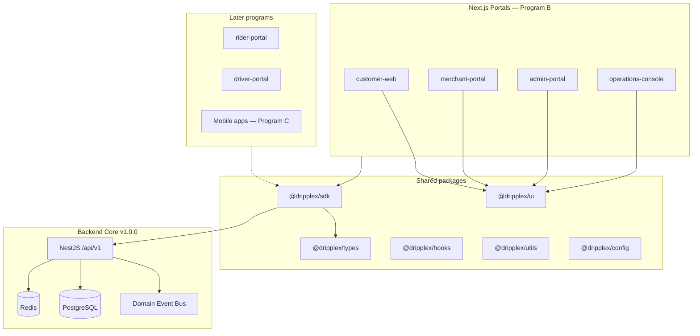
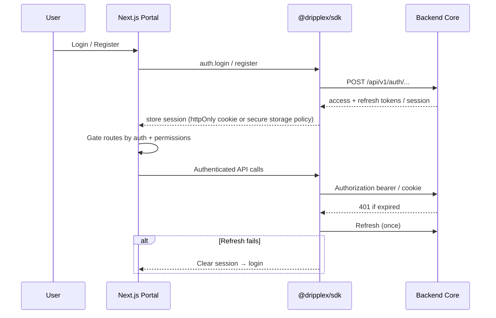

# FPX-001 — Dripplex Frontend Platform Architecture

| Field            | Value                                                                                         |
| ---------------- | --------------------------------------------------------------------------------------------- |
| **Document ID**  | FPX-001                                                                                       |
| **Title**        | Dripplex Frontend Platform Architecture                                                       |
| **Platform**     | Dripplex — _life,Simplified_                                                                  |
| **Program**      | B — Frontend Platform                                                                         |
| **Status**       | **Adopted — As-Built Frontend Architecture Reference**                                        |
| **Scope**        | Vision, structure, boundaries, integration (reference doc)                                    |
| **Baseline**     | Backend Core (`v1.0.0-backend-core` and later) + the frontend platform as it exists on `main` |
| **Supersedes**   | `docs/frontend/DPX-F001`–`DPX-F010` stubs                                                     |
| **Last updated** | 2026-08-08                                                                                    |

---

## Executive summary

FPX-001 defines the **entire frontend ecosystem** for Dripplex: Customer Web, Merchant Portal, Admin Portal, Operations Console, and the Driver and Rider portals, plus the shared packages that bind them to Backend Core.

Just as the **DPX** series guided the NestJS backend, the **FPX** (Frontend Platform Experience) series is the official architecture reference for every Dripplex web application.

> **Adoption note (2026-08-08).** This document is adopted as the **as-built** frontend architecture reference. The frontend platform — all six apps and the six shared packages — is already implemented on `main`; this doc describes and standardizes that architecture rather than gating it. It supersedes the earlier `docs/frontend/DPX-F001`–`DPX-F010` stubs. It is _not_ a pre-implementation approval gate: earlier "no UI coding until FPX-001…010 are approved" language has been removed, because the UI already exists. FPX-002…010 are **future/optional** deep-dive documents that do not yet exist (see §15).

**Principles (shared with Backend Core):**

- Shared contracts via `@dripplex/types` and `@dripplex/sdk`
- Versioned REST under `/api/v1/` with `{ success, data }` envelopes
- Strict TypeScript — no `any`
- RBAC permissions mirrored in UI gates
- Backend Core's commerce/auth foundation (auth, checkout, payments, delivery) is stable and evolves deliberately; feature work continues in active domains (e.g. the Driver module and its admin/operations surfaces)

---

## Table of contents

1. [Frontend philosophy](#1-frontend-philosophy)
2. [Platform context](#2-platform-context)
3. [Application boundaries](#3-application-boundaries)
4. [Monorepo frontend structure](#4-monorepo-frontend-structure)
5. [Shared packages](#5-shared-packages)
6. [API consumption strategy](#6-api-consumption-strategy)
7. [Authentication & session flow](#7-authentication--session-flow)
8. [State management posture](#8-state-management-posture)
9. [Routing posture](#9-routing-posture)
10. [Design system & Figma](#10-design-system--figma)
11. [Responsive, PWA, accessibility, performance](#11-responsive-pwa-accessibility-performance)
12. [Offline strategy](#12-offline-strategy)
13. [Realtime (Program B later / Program C adjacency)](#13-realtime-program-b-later--program-c-adjacency)
14. [Quality gates & engineering standards](#14-quality-gates--engineering-standards)
15. [FPX document series](#15-fpx-document-series)
16. [Program B delivery sequence](#16-program-b-delivery-sequence)
17. [Open decisions](#17-open-decisions)
18. [Approval checklist](#18-approval-checklist)

---

## 1. Frontend philosophy

Dripplex frontends are **product surfaces**, not independent backends. They:

1. **Express Backend Core** — never reinvent identity, cart, checkout, payment, or delivery rules in the client.
2. **Share one visual language** — all portals consume `@dripplex/ui` and FPX-002 tokens.
3. **Prefer composition over pages of one-offs** — design-system primitives first; screens second.
4. **Design before code** — Figma lock → Cursor/implement → review against FPX.
5. **Stay boring where it matters** — predictable data fetching, explicit auth, accessible defaults.
6. **Optimize for Nigeria-first usage** — resilient networks, clear offline/degraded states, mobile-aware layouts.

### Non-goals for FPX-001

- Choosing final hex colors or type specimens (FPX-002)
- Screen-by-screen UX copy (FPX-003…006)
- Implementing React components or Next.js routes
- Changing Backend Core APIs

---

## 2. Platform context



| Layer     | Technology (current monorepo)   | Role                      |
| --------- | ------------------------------- | ------------------------- |
| Portals   | Next.js 15 App Router, React 19 | Product UX                |
| Styling   | Tailwind + `@dripplex/ui`       | Design system consumption |
| Contracts | `@dripplex/types`               | DTOs, Zod schemas, enums  |
| HTTP      | `@dripplex/sdk`                 | Sole API client           |
| Backend   | NestJS + Prisma                 | Frozen marketplace engine |

---

## 3. Application boundaries

Each portal is a **separate Next.js app** under `apps/` with a dedicated audience and permission set. Cross-portal navigation is via absolute URLs / SSO session strategy (detail in FPX-009), not by importing another app’s pages.

| App                    | Package name                   | Audience                     | Primary Backend Core capabilities                                                                                                           |
| ---------------------- | ------------------------------ | ---------------------------- | ------------------------------------------------------------------------------------------------------------------------------------------- |
| **Customer Web**       | `@dripplex/customer-web`       | Shoppers                     | Auth, addresses, search, cart, checkout, orders, payment, delivery tracking, wishlist, reviews, wallet, loyalty, notifications, CMS content |
| **Merchant Portal**    | `@dripplex/merchant-portal`    | Store operators              | Auth, onboarding/KYC, business profile, promotions, analytics, review replies, wallet (merchant)                                            |
| **Admin Portal**       | `@dripplex/admin-portal`       | Platform administrators      | Users/roles, merchants, CMS publish, promotions, wallet adjustments, analytics, platform settings                                           |
| **Operations Console** | `@dripplex/operations-console` | Support / risk / content ops | Fraud queue (observational), notification broadcast, CMS ops, moderation, reports                                                           |
| Rider Portal           | `@dripplex/rider-portal`       | Riders                       | Delivery jobs (exists in monorepo; product polish may trail B2–B5 or align with Program C)                                                  |
| Driver Portal          | `@dripplex/driver-portal`      | Drivers                      | Ride/driver flows (later; not Program B critical path)                                                                                      |

### Boundary rules

- **No cross-app source imports** (`customer-web` must not import from `merchant-portal/src`).
- Shared UI and logic live only in `packages/*`.
- Portal-specific feature folders stay inside that app.
- Permission codes from Backend Core seeds gate UI actions (hide vs disable policy defined in FPX-003…006).

---

## 4. Monorepo frontend structure

Aligned with ADR-0001 (Turborepo + pnpm):

```text
apps/
  customer-web/          # Program B primary product surface
  merchant-portal/
  admin-portal/
  operations-console/
  rider-portal/          # retained; schedule via Program B/C planning
  driver-portal/
  backend/               # Backend Core — frozen feature set
packages/
  ui/                    # Design system primitives (FPX-002)
  sdk/                   # HTTP + domain clients
  types/                 # Shared contracts + Zod
  hooks/                 # Cross-app React hooks
  utils/                 # Pure helpers
  config/                # ESLint / TS / Prettier baselines
docs/
  FPX-001-...            # This series
  frontend/              # Legacy DPX-F stubs → superseded
```

### Per-app conventions (target)

```text
apps/<portal>/
  src/
    app/                 # App Router: layouts, pages, route groups
    components/          # Portal-specific compositions (not primitives)
    features/            # Optional domain slices (cart, orders, …)
    lib/                 # Portal wiring (auth provider, query client)
    styles/              # Minimal; prefer tokens from @dripplex/ui
```

Exact folder names are finalized in FPX-009; apps must remain consistent with each other.

---

## 5. Shared packages

| Package            | Responsibility                                       | Consumers                                  |
| ------------------ | ---------------------------------------------------- | ------------------------------------------ |
| `@dripplex/ui`     | Primitives, tokens, themes, Storybook stories        | All portals                                |
| `@dripplex/sdk`    | `DripplexClient`, auth + commerce + platform clients | All portals                                |
| `@dripplex/types`  | Types, enums, Zod schemas                            | All portals + SDK + backend DTOs alignment |
| `@dripplex/hooks`  | Auth session hooks, media queries, etc.              | All portals                                |
| `@dripplex/utils`  | Formatting, money helpers, guards                    | All portals                                |
| `@dripplex/config` | Shared lint/TS config                                | All packages/apps                          |

### Package rules

1. **Primitives only in `@dripplex/ui`** — no portal business pages.
2. **No HTTP outside `@dripplex/sdk`** in feature code.
3. Prefer **Zod schemas from `@dripplex/types`** for forms (already used by customer-web).
4. Avoid circular dependencies: `ui` must not depend on `sdk`.

---

## 6. API consumption strategy

### Single client

All Backend Core access goes through `@dripplex/sdk`:

```text
UI / Server Action / Route Handler
        → DripplexClient (sdk)
        → /api/v1/...
        → NestJS
```

### Contracts

- OpenAPI interim artifact: `apps/backend/openapi/platform-supporting-systems.openapi.yaml`
- Auth/commerce contracts remain as implemented in Backend Core + `@dripplex/types`
- When SDK and backend disagree, **fix the SDK** (or file a backend bug) — do not fork client shapes in apps

### Data fetching (direction — detail in FPX-007 / FPX-008)

| Concern                  | Direction                                                                                    |
| ------------------------ | -------------------------------------------------------------------------------------------- |
| Server Components        | Prefer for public/read-mostly marketing & CMS content where auth cookies allow               |
| Client interactive flows | Cart, checkout, tracking, dashboards                                                         |
| Async cache              | **TanStack Query (React Query)** as default for client server-state                          |
| Mutations                | SDK methods + Query invalidation; optimistic UI only where safe                              |
| Errors                   | Map API envelope to user-visible toasts / inline errors; never swallow 401                   |
| Retries                  | Idempotent GETs yes; payments/checkout mutations no automatic retry without idempotency keys |

### Caching principles

- Catalog/search: short TTL, stale-while-revalidate acceptable
- Cart/orders/wallet: prefer freshness; invalidate on mutation
- Never cache payment confirmation optimistically as “paid”

---

## 7. Authentication & session flow

Backend Core owns identity (DPX-013). Frontends **consume** it.



### Rules

1. Portal login types match Backend Core (`customer`, `merchant`, admin/ops roles).
2. UI permission gates use the same permission **codes** as Nest `@RequirePermissions`.
3. Do not store long-lived secrets in `localStorage` without an explicit FPX-007 security decision; prefer httpOnly cookies where Next.js BFF pattern is adopted.
4. Password reset confirm field is **client-only** (`resetPasswordUiSchema`) — never send `confirmPassword` to the API.

Detail of cookie vs bearer storage is an **open decision** (§17) locked before B1 implementation.

---

## 8. State management posture

**Decision direction (to be ratified in FPX-008):**

| State type                    | Tool                                                                          |
| ----------------------------- | ----------------------------------------------------------------------------- |
| Server/async data             | **TanStack Query**                                                            |
| Auth session                  | Dedicated Auth provider + `@dripplex/hooks`                                   |
| Forms                         | React Hook Form + Zod (`@dripplex/types`)                                     |
| Ephemeral UI (modals, toasts) | Local React state / UI primitives                                             |
| Cross-route client UI prefs   | Minimal store (**Zustand** already in customer-web) — not for domain entities |

### Explicitly not default

- **Redux Toolkit** — not required for Program B unless a portal proves irreducible global complexity
- Duplicating cart/order entities in a client store when Backend Core already owns them

FPX-008 will finalize this matrix; FPX-001 locks the _posture_: server state in Query, forms in RHF, thin client stores only.

---

## 9. Routing posture

Detail lives in **FPX-009**. FPX-001 locks:

1. **Next.js App Router** for all Program B portals
2. **Route groups** for `(public)`, `(auth)`, `(app)` / dashboard shells
3. **Protected routes** checked in layouts (session + permission)
4. **Deep links** supported for orders, tracking, shared wishlists, CMS pages
5. Locale strategy coordinated with i18n (open decision)

No portal invents a parallel router.

---

## 10. Design system & Figma

### Code

`@dripplex/ui` is the **only** component library for product UI. FPX-002 defines tokens (color, type, space, elevation, motion), themes (light/dark), and component rules.

### Figma (mandatory for screens)

For every major screen in FPX-003…006:

1. Design in Figma
2. Review and approve
3. Lock the frame/version
4. Implement with Cursor / engineers against `@dripplex/ui`

### Implementation order (Program B)

```text
FPX docs approved
    → FPX-002 Design System (tokens + primitives + Storybook)
    → Figma portals
    → Customer Web screens
    → Merchant / Admin / Operations
```

**Do not build product pages before design-system primitives.**

---

## 11. Responsive, PWA, accessibility, performance

Ratified in **FPX-010**. FPX-001 baselines:

| Concern             | Baseline                                                                                     |
| ------------------- | -------------------------------------------------------------------------------------------- |
| Breakpoints         | Mobile-first; tablet and desktop layouts required for Customer + Admin/Ops                   |
| PWA                 | Progressive enhancement; installability optional in B2; offline writes forbidden for payment |
| Accessibility       | WCAG 2.2 AA target (FPX-010)                                                                 |
| Performance budgets | To be set in FPX-010 (LCP/INP/CLS); catalog pages especially)                                |
| Brand surfaces      | Follow product design rules: brand-first heroes, restrained chrome, intentional motion       |

---

## 12. Offline strategy

| Capability             | Behavior                                                     |
| ---------------------- | ------------------------------------------------------------ |
| Browse/search (cached) | Degraded read OK with banner                                 |
| Cart                   | Server cart is source of truth; optimistic UI must reconcile |
| Checkout / payment     | **Online required**                                          |
| Order tracking         | Show last known state + reconnect                            |
| Wallet mutations       | Online required; respect backend idempotency                 |

Full policy: expand in FPX-007 (API) and FPX-010 (device classes).

---

## 13. Realtime (Program B later / Program C adjacency)

Backend Core has in-process domain events; realtime **sockets to browsers** are not the B0 critical path.

Planned later (Program B Phase B5 or adjacent):

- In-app notification stream
- Live delivery tracking
- Presence (ops/support)

Until then, portals poll or refresh on focus for tracking/notifications as specified in FPX-003/007.

---

## 14. Quality gates & engineering standards

Inherited and extended:

| Gate      | Requirement                                                   |
| --------- | ------------------------------------------------------------- |
| lint      | `pnpm lint` clean (Turbo)                                     |
| typecheck | `pnpm typecheck` clean                                        |
| test      | Vitest for UI logic; Playwright later for critical journeys   |
| build     | Per-app `next build`                                          |
| a11y      | Storybook + axe in CI once Storybook lands (B1 design system) |

### Coding standards

- Strict TS, no `any`
- No secrets in client bundles
- Prefer Server Components for static/public content
- Feature flags only via agreed config (not hardcoded portal forks)

---

## 15. FPX document series

FPX-002 through FPX-010 are **future/optional** deep-dive documents. They **do not yet exist** and are not prerequisites for the already-shipped frontend — each may be written later if a topic warrants a dedicated reference. This table is a placeholder index, not a set of authored docs.

| ID          | Title                                        | Status                          |
| ----------- | -------------------------------------------- | ------------------------------- |
| **FPX-001** | Frontend Vision & Architecture (this doc)    | **Adopted (as-built)**          |
| **FPX-002** | Design System                                | Future / optional — not written |
| **FPX-003** | Customer Experience                          | Future / optional — not written |
| **FPX-004** | Merchant Portal                              | Future / optional — not written |
| **FPX-005** | Admin Platform                               | Future / optional — not written |
| **FPX-006** | Operations Portal                            | Future / optional — not written |
| **FPX-007** | API Integration                              | Future / optional — not written |
| **FPX-008** | State Management                             | Future / optional — not written |
| **FPX-009** | Routing                                      | Future / optional — not written |
| **FPX-010** | Responsive Standards (incl. a11y, PWA, perf) | Future / optional — not written |

The interim `docs/frontend/DPX-F001`–`DPX-F010` stubs are retained but superseded by this document (each carries a banner pointing here).

---

## 16. Program B delivery sequence (historical plan — largely delivered)

The original Program B sequence, retained for context. The apps and shared packages it describes are now implemented on `main`; this is history, not a gate:

```text
Phase B0  Documentation lock (FPX-001 … FPX-010)
Phase B1  Design System implementation (@dripplex/ui + Storybook + Figma library)
Phase B2  Customer Web (against locked Figma)
Phase B3  Merchant Portal
Phase B4  Admin Platform
Phase B5  Operations Platform
(+ Realtime enhancements as readiness allows)
```

Backend Core's foundation is stable; feature work continues in active domains (notably the Driver module and its admin/operations surfaces). Design-before-code via the Production Figma remains the standing rule for _new_ UI.

---

## 17. Open decisions

Open architecture decisions still worth resolving. Several are now effectively settled by what shipped (e.g. D3 — Admin and Operations are already separate apps on `main`); the rest can be revisited as needed:

| #   | Decision           | Options                                                    | Owner               |
| --- | ------------------ | ---------------------------------------------------------- | ------------------- |
| D1  | Token storage      | httpOnly cookies via Next BFF vs in-memory + refresh       | Architecture review |
| D2  | i18n               | `next-intl` vs custom; default `en` + `ha`/`yo`/`ig` later | Product             |
| D3  | Admin vs Ops split | Separate apps (current) vs single app with roles           | Product + Ops       |
| D4  | Storybook host     | Package-level in `packages/ui`                             | Eng                 |
| D5  | E2E framework      | Playwright in CI                                           | Eng                 |
| D6  | Dark mode default  | System preference vs light-first marketing                 | Design              |

---

## 18. As-built confirmation

This reference is confirmed accurate against `main` when:

- [x] Application boundaries match the shipped apps (table in §3)
- [x] Shared package rules match `packages/*` (§5)
- [x] SDK-only API access holds across the portals (§6)
- [x] Auth posture matches the implemented auth (§7), incl. the admin/operations login endpoints
- [x] State posture matches current usage (§8)
- [x] Design-before-code / Production Figma remains the rule for new UI (§10)
- [ ] Any residual deviations noted for follow-up (§17 open decisions)

**Reviewers (suggested):** Product owner, Design lead, Frontend lead, Backend lead.

---

## Related documents

- `docs/PROGRAM-B.md` — Program roadmap
- `docs/RELEASE-v1.0.0-backend-core.md` — Backend Core milestone
- `docs/DPX-013.md` — Identity architecture (backend)
- `docs/architecture/overview.md` — Platform overview
- `docs/adr/0001-monorepo-turborepo-pnpm.md` — Monorepo ADR
- `apps/backend/openapi/platform-supporting-systems.openapi.yaml` — Platform OpenAPI

---

## Document control

| Version | Date       | Notes                                                                                                                                                                                                                                                                                                                                                                                                                                                                                                                                          |
| ------- | ---------- | ---------------------------------------------------------------------------------------------------------------------------------------------------------------------------------------------------------------------------------------------------------------------------------------------------------------------------------------------------------------------------------------------------------------------------------------------------------------------------------------------------------------------------------------------- |
| 0.1     | 2026-07-21 | Initial draft for review — Program B kickoff                                                                                                                                                                                                                                                                                                                                                                                                                                                                                                   |
| 1.0     | 2026-08-08 | Adopted as the as-built frontend architecture reference on current `main`. Removed the pre-implementation approval gate and stale Backend-Core feature-freeze language; reconciled with the shipped six apps (incl. Driver/Rider) and admin/operations auth; marked FPX-002–010 as future/optional (not written); superseded the `docs/frontend/DPX-F001`–`F010` stubs. Content originated from the unmerged `cursor/fpx-001-frontend-architecture` branch (PR #22), brought fresh onto `main` rather than merged (stale base, no merge base). |
