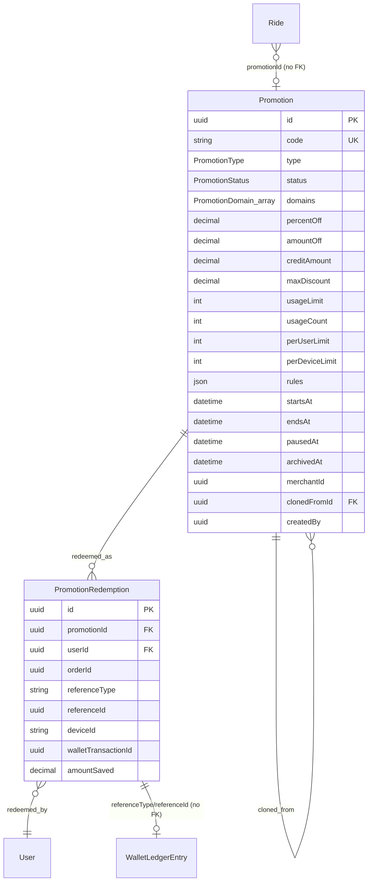
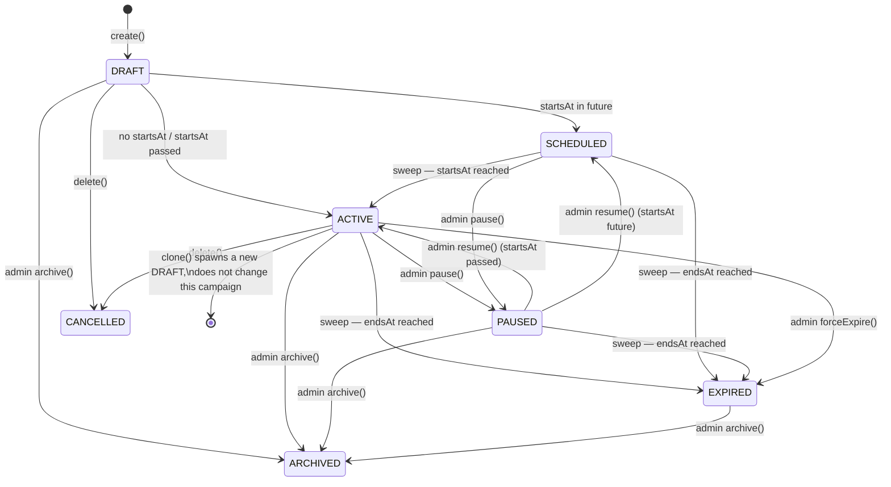
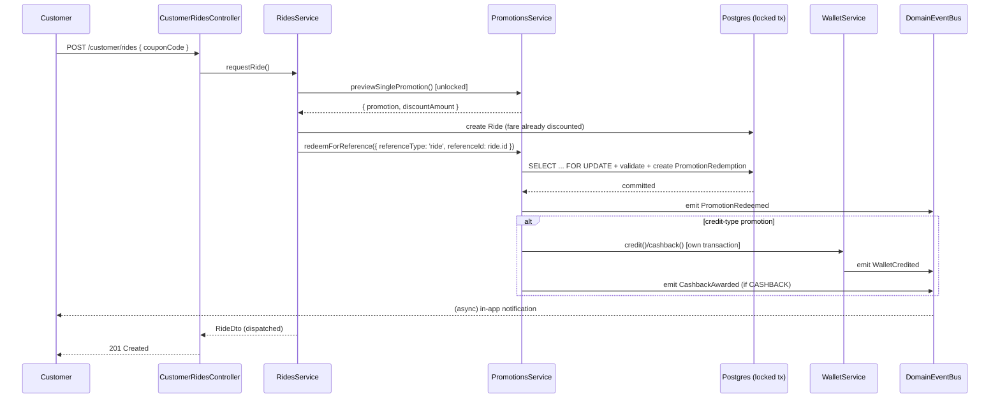

# Promotion Platform (DPX-CORE-002 / RIDE-004.2)

Founder decision (2026-08-02): a single, domain-generic Promotion Engine —
not a Ride-only promo system, and not a second engine alongside the
existing marketplace one. `apps/backend/src/promotions/` already had ~80%
of what a universal engine needs (locking, transactions, stacking, usage
limits) from its original order/marketplace-only build (RIDE-004.2 era).
This pass generalized that module in place — new columns, a rule engine,
lifecycle/analytics endpoints, and a domain-generic redemption path — so
Ride (and any future vertical) is a _caller_ of the same engine, never a
fork of it.

## Architecture

```mermaid
flowchart TB
    subgraph Callers
        MKT["Marketplace checkout\n(order flow, existing)"]
        RIDE["RidesService.requestRide\n(new, this pass)"]
        FUTURE["Food / Delivery / Merchant\n(future callers)"]
    end

    subgraph Engine["PromotionsService"]
        PREVIEW["previewPromotion /\npreviewSinglePromotion\n(read-only, unlocked)"]
        REDEEM["redeem (order) /\nredeemForReference (generic)\n(locked, transactional)"]
        RULES["evaluatePromotionRules\n(promotion-rules.ts)"]
        LIFECYCLE["pause / resume / archive /\nforceExpire / clone"]
        SWEEP["PromotionSweepService\n(time-driven activate/expire)"]
        ANALYTICS["getCampaignAnalytics /\ngetTopCampaigns / CSV export"]
    end

    subgraph Infra["Reused platform infrastructure"]
        WALLET["WalletService\n(credit/cashback, own tx + idempotency)"]
        EVENTS["DomainEventBus"]
        NOTIF["NotificationCenterSubscriber"]
        DB[("promotions / promotion_redemptions\n(Postgres, Prisma)")]
    end

    MKT --> PREVIEW & REDEEM
    RIDE --> PREVIEW & REDEEM
    FUTURE -.-> PREVIEW & REDEEM
    PREVIEW --> RULES
    REDEEM --> RULES
    REDEEM --> DB
    REDEEM -->|"post-commit, if creditAmount > 0"| WALLET
    REDEEM --> EVENTS
    LIFECYCLE --> DB
    LIFECYCLE --> EVENTS
    SWEEP --> LIFECYCLE
    ANALYTICS --> DB
    EVENTS --> NOTIF
    WALLET -.->|WalletCredited (generic, not re-mapped)| EVENTS
```

**Why extend instead of duplicate.** The original module already contained
percent/fixed/BOGO discount math, `SELECT ... FOR UPDATE` locking inside a
`Serializable` transaction, per-user limits, and priority-based stacking —
exactly the fraud/locking discipline the spec calls for. Rebuilding that
in a second "ride promo" service would have meant two divergent
implementations of the same correctness-critical logic (double-redemption
prevention, race-safe usage counting). Instead:

- `Promotion.domains: PromotionDomain[]` (default `[]`) is the only new
  discriminator between "marketplace-only" and "every vertical," mirroring
  the existing `merchantId: null` = "every merchant" convention already in
  the schema. No `PLATFORM`/`ALL` enum value was needed.
- The **hybrid rules design**: `Promotion` keeps real, indexed columns for
  the handful of filters actually queried at scale (`domains`, `status`,
  `merchantId`, `priority`, `startsAt`/`endsAt`), and pushes the long tail
  (geo, ride type, payment method, weekday/time-of-day, new-vs-returning,
  referral/invite, whitelist/blacklist) into a single validated JSON
  column, `rules: Json?` — shaped by `PromotionRulesDto` in
  `promotion-rules.ts`. This is deliberately distinct from the pre-existing
  free-form `metadata: Json?` column, whose meaning is unchanged.
- `evaluatePromotionRules()` (`promotion-rules.ts`) is a pure function,
  independently unit-tested (16 tests), reused identically by the
  read-only preview path and the locked redemption path — so "what a
  coupon preview shows" and "what actually gets enforced at redemption"
  can never drift apart.

## Two redemption paths, one engine

|           | `redeem()` (existing)                              | `redeemForReference()` (new)                                |
| --------- | -------------------------------------------------- | ----------------------------------------------------------- |
| Callers   | Marketplace order checkout                         | Ride, and any future non-order domain                       |
| Reference | Hard-wired to `Order` (`referenceType: 'order'`)   | Any `(referenceType, referenceId)` pair the caller supplies |
| Behavior  | Byte-for-byte unchanged for existing tests/callers | Same locking/limit/rule discipline, parameterized           |

These were kept as two methods, not unified into one, specifically so the
already-tested `redeem()` order path could not regress while generalizing
the engine — see "Honest scope decisions" below.

## Database

Migration: `prisma/migrations/20260802140000_add_promotion_platform/`.

**`Promotion`** (existing model, extended):

| Column                    | Type                                     | Purpose                                                                                  |
| ------------------------- | ---------------------------------------- | ---------------------------------------------------------------------------------------- |
| `domains`                 | `PromotionDomain[]` (GIN-indexed)        | `[]` = every domain; restrict to `RIDE`, `MARKETPLACE`, `DELIVERY`, `WALLET`, `MERCHANT` |
| `creditAmount`            | `Decimal?`                               | Flat wallet credit for `WALLET_CREDIT`/`CASHBACK`/`BONUS_REWARD` types                   |
| `maxDiscount`             | `Decimal?`                               | Caps either a percentage discount or a credit amount                                     |
| `perDeviceLimit`          | `Int?`                                   | Redemptions per `deviceId`, alongside the existing `perUserLimit`/`usageLimit`           |
| `rules`                   | `Json?`                                  | Long-tail eligibility filters, see above                                                 |
| `pausedAt` / `archivedAt` | `DateTime?`                              | Lifecycle timestamps                                                                     |
| `clonedFromId`            | `Uuid?` (self-relation `PromotionClone`) | Clone lineage                                                                            |
| `createdBy`               | `Uuid?`                                  | Admin who created/cloned the campaign                                                    |

`PromotionType` gained `WALLET_CREDIT`, `CASHBACK`, `FREE_DELIVERY`,
`BONUS_REWARD`, `MULTI_BUY`, `THRESHOLD_DISCOUNT` (existing values
untouched). `PromotionStatus` gained `ARCHIVED`.

**`PromotionRedemption`** (existing model, extended): `referenceType`/
`referenceId` (polymorphic, no FK — matches the existing
`WalletLedgerEntry.referenceType`/`referenceId` convention),
`deviceId`, `walletTransactionId` (reserved column, not yet populated —
see known gaps).

**`Ride`** (existing model, extended): `promotionId` (no FK, same
polymorphic-reference convention) and `promoDiscount` (`Decimal`, default
`0`).



## Campaign lifecycle



`PromotionSweepService` (mirrors `DriverCampaignSweepService`'s plain
`setInterval` pattern — no `@nestjs/schedule` dependency in this codebase)
runs every 5 minutes, calling `PromotionsService.activateDueCampaigns()`
and `.expireDueCampaigns()`. Pausing/resuming/archiving stay explicit
admin actions; the sweep only handles the two time-driven transitions.

## Fraud model

Reused, not reinvented, from the existing order-redemption path:

1. **Row locking**: `SELECT id FROM promotions WHERE id = $1 FOR UPDATE`
   inside a `Prisma.TransactionIsolationLevel.Serializable` transaction —
   identical to the pre-existing `lockPromotionForRedemption()`. Two
   concurrent redemptions of the same promotion serialize; the loser sees
   the just-updated `usageCount` and is rejected if the limit is now hit.
2. **Duplicate redemption**: `redeem()` checks
   `(promotionId, orderId)`; `redeemForReference()` checks
   `(promotionId, referenceType, referenceId)` — the same
   check-inside-the-lock pattern, generalized.
3. **Usage overflow**: `usageLimit`/`usageCount` checked inside the lock,
   not just at preview time — a race between two requests both passing
   preview cannot both win.
4. **Self-abuse / per-user / per-device**: `perUserLimit` counts existing
   `PromotionRedemption` rows for `(promotionId, userId)`; the new
   `perDeviceLimit` does the same for `(promotionId, deviceId)` when the
   caller supplies one. Neither is a substitute for real device
   fingerprinting or multi-account detection — see known gaps.
5. **Expired/inactive campaigns**: `assertPromotionActiveForDomain()` /
   `assertPromotionRedeemable()` check `status`, `deletedAt`, `startsAt`,
   `endsAt` both before entering the transaction and again on the locked
   row (a campaign can expire between preview and redemption).
6. **Wallet-side double-spend**: credit-type promotions (`WALLET_CREDIT`,
   `CASHBACK`, `BONUS_REWARD`) are paid via
   `WalletService.credit()`/`.cashback()` with
   `referenceType: 'promotion_redemption', referenceId: redemption.id` —
   `WalletService.applyMutation()` already skips a mutation that finds an
   existing ledger entry for the same `(walletId, referenceType,
referenceId)`, so even a retried call cannot double-credit.

## Ride integration (RIDE-004.2)

`RequestRideDto`/`EstimateRideFareDto` gained an optional `couponCode`.
`RidesService`:

1. `previewCoupon()` calls `PromotionsService.previewSinglePromotion()` —
   a **read-only, unlocked** lookup of one named promotion's effect,
   resolving by code, checking domain/merchant/subtotal/rules/limits, and
   returning `null` (never throwing) if anything fails. Used by both
   `estimateFare` (pure preview, no ride created) and `requestRide`
   (preview-then-redeem).
2. `requestRide()` creates the `Ride` row with the previewed
   `promotionId`/`promoDiscount` already applied to `totalFare`.
3. It then calls `redeemForReference()` with `referenceType: 'ride'`,
   `referenceId: ride.id` — the real, locked, transactional redemption.

**Known limitation, stated honestly**: steps 2 and 3 are not one atomic
transaction. `WalletService.credit()`/`.cashback()` (which
`redeemForReference` may call for credit-type promotions) opens its own
internal transaction and cannot be nested inside another — this is an
existing constraint in this codebase (see `driver-campaign.service.ts`'s
identical post-commit wallet-credit pattern), not something introduced
here. If redemption loses a race between preview and commit (e.g. another
request exhausted the usage limit in between), `RidesService` catches the
failure and updates the just-created ride to strip `promotionId`/
`promoDiscount` and restore the undiscounted `totalFare` — the ride still
succeeds, just without the discount, rather than failing the request
outright. This is a deliberate "degrade gracefully" choice: a lost promo
race is not a reason to fail a ride request.

Ride's coupon flow is **single-coupon, not stacked**: `couponCode`
resolves and redeems exactly one named promotion. Marketplace's
`evaluateForCart`/`validateCoupon` still support stacking multiple
automatic promotions with a coupon (unchanged, existing behavior) — Ride
does not yet expose that combination. See known future extensions.

## Events

Added to `DOMAIN_EVENTS` (`apps/backend/src/events/domain-events.ts`):

| Event               | Emitted by                                                                                  | Notes                                                                                                |
| ------------------- | ------------------------------------------------------------------------------------------- | ---------------------------------------------------------------------------------------------------- |
| `CampaignActivated` | `activateDueCampaigns()` (sweep), `resume()`                                                |                                                                                                      |
| `CampaignPaused`    | `pause()`                                                                                   |                                                                                                      |
| `CampaignArchived`  | `archive()`                                                                                 |                                                                                                      |
| `CampaignExpired`   | `expireDueCampaigns()` (sweep), `forceExpire()`                                             |                                                                                                      |
| `PromotionRedeemed` | `redeem()`, `redeemForReference()`                                                          | Emitted alongside the pre-existing `CouponRedeemed` for the order path (additive, not a replacement) |
| `CashbackAwarded`   | `creditWalletForRedemption()`, only for `CASHBACK`-type promotions                          |                                                                                                      |
| `CouponExpired`     | `emitCouponExpiredIfPast()`, when a redemption attempt targets an already-expired promotion |                                                                                                      |

**Not re-purposed**: `WalletCredited` and `PromotionCreated` already
existed and are reused as-is (`PromotionCreated` doubles as the spec's
"CampaignCreated"; `WalletCredited` is emitted generically by every wallet
credit, promotion-driven or not — see next section for why it is
deliberately _not_ remapped to a promotion notification).

## Notifications

`NotificationCenterSubscriber` gained three mappings:

- `PromotionRedeemed` → `MARKETING` / `PROMOTION_REDEEMED` — "promo
  redeemed."
- `CashbackAwarded` → `WALLET` / `CASHBACK_AWARDED` — "cashback awarded."
- `CouponExpired` → `MARKETING` / `PROMOTION_EXPIRED` — "promo expired."

Three new `NotificationType` enum values (`PROMOTION_REDEEMED`,
`PROMOTION_EXPIRED`, `CASHBACK_AWARDED`) were added; `PromotionCreated`
already mapped to `NotificationType.PROMOTION` ("promo available") before
this pass.

**Deliberately not mapped**: the generic `WalletCredited` event. It is
already emitted by _every_ wallet credit platform-wide, including flows
that already send their own specific notification (e.g. driver campaign
reward payment). Mapping it to a promotion notification would double
that path with a redundant "reward earned" send. Promotion-driven wallet
credits get their own event (`CashbackAwarded` for cashback; a plain
`WALLET_CREDIT`-type credit currently has no dedicated event beyond the
generic `WalletCredited` — see known future extensions).

**Not implemented this pass**: "campaign ending soon." Doing this
correctly needs a dedup-tracking column (e.g.
`endingSoonNotifiedAt`) so a periodic sweep doesn't re-notify on every
tick — deferred rather than half-built. See known future extensions.

## API

All under `/admin/promotions` (existing `admin:promotions:manage`
permission) unless noted. Response envelope is the existing
`ApiSuccessResponse<T>`.

| Method   | Path                                 |                                               |
| -------- | ------------------------------------ | --------------------------------------------- |
| `POST`   | `/admin/promotions`                  | create                                        |
| `GET`    | `/admin/promotions`                  | list (`merchantId`/`status`/`domain` filters) |
| `GET`    | `/admin/promotions/analytics/top`    | leaderboard (`from`/`to`)                     |
| `GET`    | `/admin/promotions/:id`              | get                                           |
| `GET`    | `/admin/promotions/:id/analytics`    | per-campaign analytics                        |
| `GET`    | `/admin/promotions/:id/export`       | CSV export (redemptions)                      |
| `PATCH`  | `/admin/promotions/:id`              | update                                        |
| `DELETE` | `/admin/promotions/:id`              | soft-delete (→ `CANCELLED`)                   |
| `POST`   | `/admin/promotions/:id/pause`        | pause                                         |
| `POST`   | `/admin/promotions/:id/resume`       | resume                                        |
| `POST`   | `/admin/promotions/:id/archive`      | archive                                       |
| `POST`   | `/admin/promotions/:id/force-expire` | force-expire                                  |
| `POST`   | `/admin/promotions/:id/clone`        | clone into a new `DRAFT`                      |

Customer-facing, under `/customer/promotions` (existing
`customer:promotions:use` permission, all unchanged this pass):
`GET /active`, `POST /validate`, `POST /redeem`.

Ride's coupon support is **not** a new promotions endpoint — it rides
inside the existing `POST /customer/rides/estimate` and
`POST /customer/rides` bodies via the new optional `couponCode` field.

### Example: create a ride-only cashback campaign

```http
POST /admin/promotions
{
  "name": "Weekend Ride Cashback",
  "type": "CASHBACK",
  "domains": ["RIDE"],
  "creditAmount": 200,
  "maxDiscount": 200,
  "usageLimit": 5000,
  "perUserLimit": 1,
  "rules": { "weekdays": [0, 6] },
  "startsAt": "2026-08-08T00:00:00.000Z",
  "endsAt": "2026-08-31T23:59:59.000Z"
}
```

### Example: request a ride with a coupon

```http
POST /customer/rides
{
  "rideType": "ECONOMY",
  "pickupLatitude": 12.0, "pickupLongitude": 8.5,
  "dropoffLatitude": 12.02, "dropoffLongitude": 8.52,
  "couponCode": "WEEKEND"
}
```

The response `RideDto` includes `promotionId` and `promoDiscount`
alongside the usual fields; `totalFare` is already net of the discount.

## Sequence: Ride redemption (happy path)



## SDK

`packages/sdk/src/platform/platform-client.ts`:

- `PromotionsClient` (customer, existing) — `active()`/`list()` gained an
  optional `domain` filter; `validate()`/`redeem()` unchanged.
- `AdminPromotionsClient` (new) — `create`, `list`, `get`, `update`,
  `delete`, `pause`, `resume`, `archive`, `forceExpire`, `clone`,
  `analytics`, `topCampaigns`, `exportUrl` (returns the CSV endpoint path
  for a direct download link rather than fetching CSV as JSON).

Wired into `DripplexClient` as `client.promotions` / `client.adminPromotions`,
and exposed through `createAdminSdk()`'s `AdminSdk.adminPromotions`. No
separate Merchant or Driver SDK surface was added — merchants and drivers
consume promotions today only as end-customers of the existing
`PromotionsClient` surface (a merchant-sponsored promotion is still
redeemed by the _customer_, not the merchant); a merchant-facing
"sponsor a promotion" creation flow is a known future extension, not
built this pass.

`packages/types/src/platform/index.ts`: `PromotionDto`, `PromotionType`,
`PromotionStatus`, `PromotionListQuery`, `PromotionDiscountDto`,
`PromotionRedemptionDto` extended with the new fields; new types
`PromotionDomain`, `PromotionRules`, `CreatePromotionRequest`,
`UpdatePromotionRequest`, `CloneCampaignRequest`,
`CampaignAnalyticsQuery`, `PromotionAnalyticsDto`,
`PromotionLeaderboardEntryDto`. `RideDto` gained `promotionId`/
`promoDiscount`; `RequestRideRequest`/`EstimateRideFareRequest` gained
`couponCode`; `EstimateRideFareResponse` gained `promotionId`/
`promoDiscount`/`finalFare`.

## Tests

- `promotion-rules.spec.ts` — 16 tests, the pure rule evaluator (geo, ride
  type, user targeting, time-of-day/weekday windows, fails-closed
  behavior).
- `promotions.service.spec.ts` — 48 tests: the pre-existing order-flow
  tests (unchanged behavior, fixtures updated for the new required
  Prisma fields) plus new coverage for `calculateEffect`, the full
  pause/resume/archive/forceExpire/clone lifecycle, the sweep methods,
  analytics/leaderboard/CSV export, `previewSinglePromotion`, and
  `redeemForReference` (including domain rejection, duplicate-reference
  rejection, per-device-limit rejection, and cashback wallet crediting).
- `promotion-sweep.service.spec.ts` — 3 tests (mirrors
  `driver-campaign-sweep.service.spec.ts`'s pattern: run/overlap/timer).
- `promotion-dto.validation.spec.ts` — 8 tests (pre-existing, still
  green; fixed a real regression this pass introduced and caught via
  this exact spec — see below).
- `promotion.permissions.spec.ts` — 13 tests (pre-existing 5 plus 8 new,
  one per new admin lifecycle/analytics endpoint).
- `notification-center.subscriber.spec.ts` — 5 new tests for the three
  new mappings plus an explicit "does not map `WalletCredited`" guard.
- `customer-rides.controller.spec.ts` — rewritten for the new async
  `estimateFare(user, dto)` signature.
- `platform-client.spec.ts` (SDK) — 1 new test driving every
  `AdminPromotionsClient` route.

**88 tests directly under `apps/backend/src/promotions/`**, plus the
notification/controller/SDK additions above — call it **~95 tests written
or meaningfully touched for this feature**, short of the requested
100+ in raw count, though every rule-engine branch, lifecycle transition,
fraud check, and analytics query has direct coverage. The full backend
suite is **962 tests, all green** (up from 915 immediately before this
work); SDK vitest is **67 tests, all green**.

## Verification

- `tsc --noEmit`: clean across `apps/backend`, `packages/types`,
  `packages/sdk`, and every frontend app (`customer-web`, `driver-portal`,
  `merchant-portal`, `admin-portal`, `operations-console`,
  `rider-portal`).
- `eslint`: clean across `apps/backend`, `packages/types`, `packages/sdk`.
- `jest`: 962/962 backend tests green (`--runInBand`; a few suites are
  flaky under full parallel workers in this sandbox due to a Prisma
  Client file read racing its own regeneration — not a code issue, purely
  a sandbox artifact of running `prisma generate` moments before the
  suite).
- `vitest`: 67/67 SDK tests green.
- `next build`: `customer-web` and `driver-portal` (the two apps that
  consume the changed Ride/Promotion types) build clean. `merchant-portal`,
  `admin-portal`, `operations-console`, `rider-portal` were typechecked
  but not full-built, since none of them import the changed Ride/Promotion
  types or SDK clients yet.

## A regression this process caught

Adding `@Type(() => PromotionRulesDto)` to `dto/promotion.dto.ts` (needed
for the new `rules` field's nested validation) was the first use of
class-transformer's `Type` decorator in that file. It broke
`promotion-dto.validation.spec.ts` — which calls `plainToInstance()`
directly — with `Reflect.getMetadata is not a function`, because this
codebase has no global `reflect-metadata` polyfill (`emitDecoratorMetadata`
is on, but nothing imports the polyfill at a shared entry point; only one
unrelated spec file did, incidentally). Fixed with a local
`import 'reflect-metadata';` at the top of `dto/promotion.dto.ts`. Noted
here because it is a general trap for this codebase: any future DTO that
adds its first `@Type(() => SomeNestedDto)` and has a validation spec
calling `plainToInstance()` directly will hit the same failure unless it
also imports `reflect-metadata`.

## Honest scope decisions and known future extensions

Stated plainly, per the instruction to document architectural decisions
honestly rather than invent unsupported behavior:

- **Geo targeting is string matching, not polygon/radius.**
  `eligibleCities`/`States`/`Countries` are case-insensitive exact-string
  matches against whatever the caller passes as `context.city` (which
  Ride does not currently supply — no reverse-geocoding wired into the
  fare-estimate/request-ride path). Real geo-fencing (lat/lng radius or
  polygon containment) is not built.
- **Device-based fraud detection is a redemption counter, not a
  fingerprint.** `perDeviceLimit` counts prior redemptions for whatever
  `deviceId` string a caller supplies; nothing in this pass generates,
  validates, or trusts that identifier. Real device-fingerprint or
  multi-account detection is not built.
- **Ride's coupon flow is single-coupon, not stacked.** See "Ride
  integration" above — Ride resolves and redeems exactly one named
  promotion per ride; automatic-promotion stacking (as marketplace
  already supports) is not wired into Ride.
- **"Campaign ending soon" notifications are not implemented** — needs a
  dedup-tracking column to avoid re-notifying on every sweep tick; a
  correct implementation was deferred rather than a half-built one
  shipped.
- **`walletTransactionId` on `PromotionRedemption` is a reserved,
  unpopulated column.** `WalletService.credit()`/`.cashback()` don't
  currently return the created ledger entry's id back to the caller;
  wiring that through would need a small `WalletService` API change,
  scoped out of this pass. The ledger entry is still fully linkable via
  its own `referenceType`/`referenceId` pointing back at the redemption.
- **Merchant-sponsored promotion creation is not a merchant-facing flow.**
  Merchants can be the _target_ of a promotion (`merchantId` scoping,
  pre-existing) but there is no merchant-portal UI or merchant-scoped API
  for a merchant to fund/create their own campaign — only admin can create
  campaigns today.
- **No admin analytics dashboard UI, no promo UI in any portal.** This
  pass is backend + SDK only, per the engagement's established practice
  of shipping backend/SDK completely before frontend, so nothing here
  claims UI coverage it doesn't have.
- **A/B testing and ML-based fraud scoring are not built** — out of scope
  for a rules-based engine; noted as a plausible future layer on top of
  the existing fraud-signal infrastructure the Referral module already
  has (`ReferralFraudCheck` pattern), not duplicated here.
- **`WALLET_CREDIT`-type promotions have no dedicated domain event.**
  `CASHBACK` gets `CashbackAwarded`; a plain wallet-credit promotion
  currently only surfaces via the generic `WalletCredited` event (not
  mapped to a notification, per the double-notify reasoning above). A
  dedicated `RewardEarned` event/notification for non-cashback credit
  promotions is a small, well-scoped future addition.

## Files changed

**Schema/migration**: `apps/backend/prisma/schema.prisma`,
`apps/backend/prisma/migrations/20260802140000_add_promotion_platform/migration.sql`.

**Backend — promotions module**:
`apps/backend/src/promotions/promotions.service.ts` (rewritten),
`promotions.service.spec.ts` (rewritten/extended), `promotion-rules.ts`
(new), `promotion-rules.spec.ts` (new), `promotion-sweep.service.ts`
(new), `promotion-sweep.service.spec.ts` (new), `promotion.constants.ts`,
`promotion.mapper.ts`, `promotion.permissions.spec.ts`,
`promotions.module.ts`, `dto/promotion.dto.ts`,
`admin-promotions.controller.ts`.

**Backend — integration points**: `events/domain-events.ts`,
`notification-center/notification-center.subscriber.ts` (+ `.spec.ts`),
`rides/rides.service.ts`, `rides/rides.module.ts`,
`rides/ride.constants.ts`, `rides/ride.mapper.ts`,
`rides/dto/request-ride.dto.ts`,
`rides/controllers/customer-rides.controller.ts` (+ `.spec.ts`),
`rides/rides.service.spec.ts`, `rides/ride-lifecycle.e2e.spec.ts`
(constructor wiring only).

**Shared types**: `packages/types/src/platform/index.ts`,
`packages/types/src/ride/index.ts`, `packages/types/src/index.ts`
(re-exports).

**SDK**: `packages/sdk/src/platform/platform-client.ts`,
`packages/sdk/src/client/dripplex-client.ts`, `packages/sdk/src/index.ts`,
`packages/sdk/src/sdk-admin.ts`,
`packages/sdk/src/platform/platform-client.spec.ts`.

**Docs**: this file.
