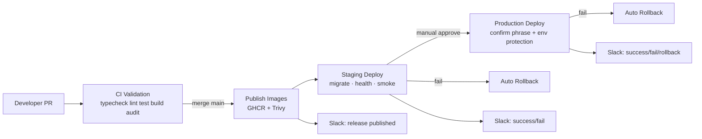

# D2 — CI/CD architecture

## Environments (isolated)

| Env         | Domains (example)        | Data                | Secrets                 | Monitoring      |
| ----------- | ------------------------ | ------------------- | ----------------------- | --------------- |
| Development | localhost                | local Compose       | `.env` (gitignored)     | optional        |
| Staging     | `*.staging.dripplex.com` | staging PG/Redis/R2 | GitHub `staging` env    | staging Grafana |
| Production  | `*.dripplex.com`         | prod PG/Redis/R2    | GitHub `production` env | prod Grafana    |

## Components

| Layer    | Tech                                        |
| -------- | ------------------------------------------- |
| CI       | GitHub Actions `ci.yml`                     |
| Registry | GHCR (`ghcr.io/<owner>/dripplex-*`)         |
| Deploy   | `scripts/cicd/pipeline.sh` over SSH/Compose |
| Validate | health + smoke HTTP suite                   |
| Notify   | Slack webhook                               |
| Rollback | previous image tag file on host             |

See also D1 topology: `docs/infrastructure/TOPOLOGY.md`.
