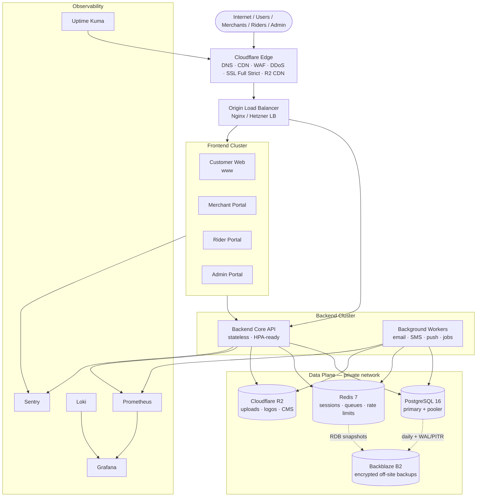

# D1 — Infrastructure diagram

## Logical architecture



## Request path (example: customer checkout)

```text
Browser → Cloudflare (TLS 1.3, WAF, CDN)
       → Origin LB :443 (Cloudflare Origin CA)
       → Customer Web (Next.js)
       → api.dripplex.com → Backend Core
       → PostgreSQL / Redis / R2
```

## Trust boundaries

| Zone        | Contents                       | Exposure                       |
| ----------- | ------------------------------ | ------------------------------ |
| Public edge | Cloudflare proxied hostnames   | Internet                       |
| DMZ / LB    | Nginx terminates TLS to origin | Cloudflare IPs only (firewall) |
| App VLAN    | Frontends, API, workers        | Private                        |
| Data VLAN   | Postgres, Redis                | Private; no public ports       |
| Ops         | Grafana, Prometheus, Kuma      | VPN / Cloudflare Access        |

See also: `docs/infrastructure/TOPOLOGY.md`.
