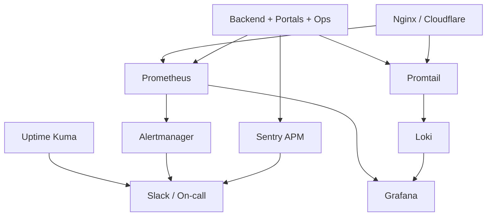

# D3 — Monitoring architecture

## Application surfaces monitored

| Surface            | Availability              | Latency / errors   | Notes                    |
| ------------------ | ------------------------- | ------------------ | ------------------------ |
| Backend Core       | blackbox `/api/v1/health` | Sentry + nginx 5xx | Pino request logs → Loki |
| Customer Web       | probe www                 | Sentry Next.js     |                          |
| Merchant Portal    | probe merchant            | Sentry             |                          |
| Rider Portal       | probe rider               | Sentry             |                          |
| Admin Portal       | probe admin               | Sentry             | Access-restricted        |
| Operations Console | internal                  | Sentry             | Not public probe         |

## Signal classes

| Class               | System                                       |
| ------------------- | -------------------------------------------- |
| Metrics             | Prometheus (+ exporters, blackbox, cAdvisor) |
| Traces / exceptions | Sentry                                       |
| Logs                | Loki via Promtail                            |
| Synthetic uptime    | Uptime Kuma + blackbox                       |
| Human status        | status.dripplex.com                          |

Configs live under `infrastructure/monitoring/`, `infrastructure/logging/`, `infrastructure/uptime-kuma/`.
